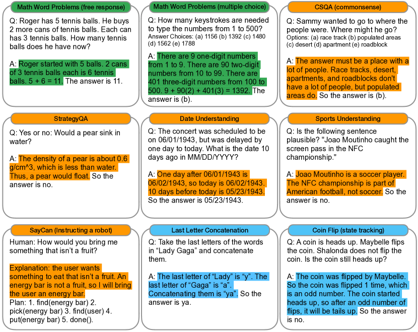
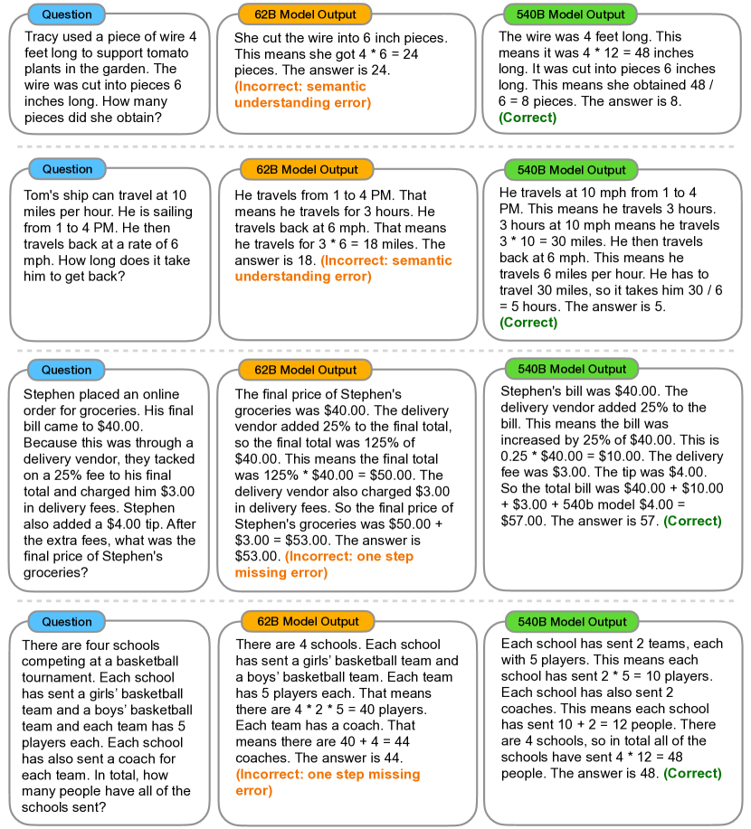
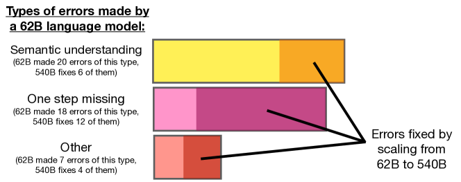

# 思维链提示激发大语言模型的推理能力（Chain-of-Thought Prompting Elicits Reasoning in Large Language Models）

> Source: https://arxiv.org/abs/2201.11903
> Collected: 2026-05-19
> Published: 2022-01-28（arXiv v1；v6 2023-01-10）
> Full text: https://ar5iv.labs.arxiv.org/html/2201.11903

## 论文信息

- **作者**：Jason Wei、Xuezhi Wang、Dale Schuurmans、Maarten Bosma、Brian Ichter、Fei Xia、Ed H. Chi、Quoc V. Le、Denny Zhou
- **机构**：Google Research, Brain Team
- **arXiv 编号**：2201.11903
- **版本历史**：v1 2022-01-28；…；v6 2023-01-10
- **会议**：NeurIPS 2022

## 摘要

研究生成一条**思维链**（chain of thought，一系列中间推理步骤）如何显著提升大语言模型执行复杂推理的能力。论文展示：在足够大的语言模型中，这种推理能力可通过一个简单方法自然涌现——**chain-of-thought prompting**，即在 few-shot 提示中提供若干"带思维链的演示"作为 exemplar。在三个大语言模型上的实验表明，思维链提示在算术、常识、符号推理一系列任务上均带来提升；其经验增益可能非常显著，例如仅用 8 个思维链 exemplar 提示 PaLM 540B，即在 GSM8K 数学应用题基准上取得 SOTA，甚至超过带验证器的微调 GPT-3。

## 分章节总结

### 1 引言

- 单纯放大模型规模，在算术、常识、符号推理这类挑战性任务上仍不足以取得高性能（Rae et al., 2021）。
- 本文方法由两个想法驱动：（a）算术推理可受益于生成"通往最终答案的自然语言推理过程"——但以往靠从零训练或微调来产生中间步骤，成本高；（b）大模型可通过 prompting 做 in-context few-shot 学习——但传统 few-shot 提示在需要推理的任务上表现差，且不随规模显著改善。
- 本文结合两者优点、规避其局限：用形如 `⟨input, chain of thought, output⟩` 的三元组做 few-shot 提示，称为 **chain-of-thought prompting**。
- 这种"仅提示"方法的价值：无需大训练集，单个模型 checkpoint 即可处理多任务。

### 2 思维链提示（Chain-of-Thought Prompting）

- 直觉来源：人解多步数学题时会把问题分解为中间步骤逐一求解后再给最终答案。目标是赋予模型生成类似思维链的能力——在 few-shot exemplar 中给出思维链演示，足够大的模型即可生成。
- 思维链提示的四个吸引人特性：
  1. 原则上允许把多步问题**分解为中间步骤**，对需更多推理步的问题分配额外计算；
  2. 提供**可解释窗口**，便于观察模型如何得出答案、调试推理出错处；
  3. 适用于数学应用题、常识推理、符号操作，原则上适用于任何人类可用语言解决的任务；
  4. 只需把思维链示例加入 few-shot exemplar，即可在足够大的**现成模型**上轻易激发，无需微调。

### 3 算术推理

#### 3.1 实验设置

- **基准（5 个数学应用题数据集）**：GSM8K（Cobbe et al., 2021）、SVAMP（结构多变）、ASDiv（多样）、AQuA（代数题，多选）、MAWPS。
- **标准提示（baseline）**：few-shot 给 input–output 对，模型直接给答案。
- **思维链提示**：每个 exemplar 增补一条思维链。手工编写 8 个带思维链的 few-shot exemplar，除多选的 AQuA（用训练集 4 个 exemplar）外，所有基准共用这同一组；这些 exemplar 未做 prompt engineering（鲁棒性见 3.4、A.2）。
- **语言模型（5 个）**：GPT-3（text-ada/babbage/curie/davinci-002，约 350M/1.3B/6.7B/175B）、LaMDA（422M–137B）、PaLM（8B/62B/540B）、UL2 20B、Codex（code-davinci-002）。采用 greedy decoding。LaMDA 报告 5 个随机种子均值。

#### 3.2 结果（三个关键结论）

1. **思维链提示是模型规模的涌现能力**（emergent ability）：对小模型无正面作用，仅在 ~100B 参数规模才带来增益；小模型会生成流畅但不合逻辑的思维链，反而低于标准提示。
2. **问题越复杂，思维链增益越大**：GSM8K（baseline 最低）在最大的 GPT/PaLM 上性能翻倍以上；而 MAWPS 中只需一步的 SingleOp 子集，提升为负或极小。
3. **与 SOTA 对比有利**：PaLM 540B 思维链提示在 GSM8K、SVAMP、MAWPS 上取得新 SOTA；在 AQuA、ASDiv 上落后 SOTA 不到 2%。
- 人工检查 LaMDA 137B 在 GSM8K 的思维链：50 个答对样本中除 2 个"碰巧答对"外思维链均逻辑/数学正确；50 个答错样本中 46% 几乎正确（计算器误差、符号映射误差或漏一步），54% 有语义理解或连贯性的重大错误。

#### 3.3 消融研究

针对"是否其他提示形式也能带来同等提升"，用 LaMDA 137B 与 PaLM 540B 测试三种变体：
- **仅方程（Equation only）**：仅输出数学方程再给答案。对 GSM8K 帮助不大（语义太复杂无法不经自然语言推理直接转方程）；对一两步问题有提升。
- **仅可变计算（Variable compute only）**：输出与所需方程字符数等长的一串点（`…`）。与 baseline 持平——说明"可变计算量"本身不是思维链有效的原因。
- **答案之后再给思维链（Chain of thought after answer）**：思维链放在答案之后。与 baseline 持平——说明思维链中的**顺序推理**有用，而非仅仅"激活预训练知识"。

#### 3.4 思维链的鲁棒性

- 由另两位作者（Annotator B、C）独立为相同 exemplar 编写思维链，Annotator A 另写一版更简洁风格。LaMDA 137B 在 GSM8K/MAWPS 上：不同标注者间虽有方差（exemplar-based prompting 的预期现象），但**所有思维链提示集都大幅超过标准 baseline**——成功不依赖特定语言风格。
- 另用从 GSM8K 训练集随机采样的 3 组 8 个 exemplar，表现与手写 exemplar 相当，同样大幅超过标准提示。
- 还发现算术推理的思维链提示对 exemplar 顺序、exemplar 数量变化也稳健（A.2）。

### 4 常识推理

- 思维链基于语言，适用于广泛的常识推理（涉及物理与人际交互、依赖一般背景知识）。
- **基准（5 个）**：CSQA、StrategyQA（多跳策略）、Date Understanding、Sports Understanding（来自 BIG-bench）、SayCan（自然语言指令→机器人动作序列）。
- **结果**：以 PaLM 为例，扩大规模提升标准提示，思维链进一步增益，PaLM 540B 提升最大。PaLM 540B 思维链在 **StrategyQA 75.6% vs 先前 SOTA 69.4%**，**Sports 95.4% vs 无辅助体育爱好者 84%**。CSQA 上增益很小。

### 5 符号推理

- **任务（2 个 toy task）**：Last letter concatenation（拼接姓名各词末字母，如 "Amy Brown"→"yn"）；Coin flip（一串人翻/不翻硬币后判断是否仍正面朝上）。
- 每个任务设 in-domain 测试集（步数与 exemplar 相同）与 OOD 测试集（步数更多）。
- **结果**：PaLM 540B 思维链在 in-domain 接近 100% 解题率；小模型仍失败——对未见符号做抽象操作的能力只在 ~100B 规模出现。OOD 上标准提示完全失败，思维链能获得上升的扩放曲线（虽低于 in-domain）——**思维链促进了超出已见思维链长度的长度泛化**。

### 6 讨论

- 思维链提示是激发大模型多步推理的简单机制：算术推理提升远强于消融变体且对标注者/exemplar/模型稳健；常识推理体现其语言本质带来的普适性；符号推理上促进 OOD 长度泛化。全程未微调任何模型。
- **规模涌现是贯穿主题**：许多任务标准提示扩放曲线平坦，思维链却带来陡升曲线；标准提示只给出大模型能力的下界。
- **局限**：（1）思维链是否等于神经网络真的在"推理"仍是开放问题；（2）few-shot 下标注成本小，但若用于微调成本高昂；（3）不保证推理路径正确，可能正确/错误答案并存；（4）思维链仅在大规模涌现，实际部署服务成本高。

### 7 相关工作（及附录 C 扩展）

本文受多个领域启发，最相关的两个方向：（1）用中间步骤解决推理问题；（2）prompting。详见原文附录 C（prompting、自然语言解释、程序合成与执行、数值与逻辑推理、中间语言步骤）。

### 8 结论

提出并研究了 chain-of-thought prompting。思维链推理是模型规模的涌现属性，使足够大的语言模型能执行原本扩放曲线平坦的推理任务，拓宽了大语言模型可成功完成的任务范围。

## 关键图表

### 图1：标准提示 vs 思维链提示

左为标准提示（直接给答案，答错）；右为思维链提示（在 exemplar 答案中加入高亮的中间推理步骤，模型随之生成推理过程并答对）。这是全文的核心示意。

### 图3：跨任务的 ⟨输入, 思维链, 输出⟩ 示例

涵盖数学应用题（自由作答/多选）、CSQA、StrategyQA、Date、Sports、SayCan（指挥机器人）、Last Letter Concatenation、Coin Flip 等任务的思维链标注示例（思维链高亮）。完整 prompt 见原文附录 G。

### 图8：PaLM 62B vs 540B 模型输出实例

同一组问题下，62B 输出常见"语义理解错误""漏一步"等错误（标 Incorrect），540B 修正为正确（标 Correct），用于分析规模如何改善思维链推理。

### 图9：62B 模型错误类型及扩放到 540B 后被修复的比例

62B 的三类错误：语义理解（62B 犯 20 个，540B 修复 6 个）、漏一步（62B 犯 18 个，540B 修复 12 个）、其他（62B 犯 7 个，540B 修复 4 个）。说明扩放到 540B 主要修复"漏一步"和"语义理解"错误。

### 表1：五个算术推理基准上的准确率（%）

思维链提示 vs 标准提示，`+ ext. calc` 为事后外接 Python 计算器（仅修正算术计算）。Prior best 为微调 SOTA：a Cobbe et al. 2021；b/e Pi et al. 2022；c Lan et al. 2021；d Piękos et al. 2021。

| 模型 | Prompting | GSM8K | SVAMP | ASDiv | AQuA | MAWPS |
|---|---|---|---|---|---|---|
| Prior best（微调） | — | 55ᵃ | 57.4ᵇ | 75.3ᶜ | 37.9ᵈ | 88.4ᵉ |
| UL2 20B | Standard | 4.1 | 10.1 | 16.0 | 20.5 | 16.6 |
| | Chain of thought | 4.4 (+0.3) | 12.5 (+2.4) | 16.9 (+0.9) | 23.6 (+3.1) | 19.1 (+2.5) |
| | + ext. calc | 6.9 | 28.3 | 34.3 | 23.6 | 42.7 |
| LaMDA 137B | Standard | 6.5 | 29.5 | 40.1 | 25.5 | 43.2 |
| | Chain of thought | 14.3 (+7.8) | 37.5 (+8.0) | 46.6 (+6.5) | 20.6 (-4.9) | 57.9 (+14.7) |
| | + ext. calc | 17.8 | 42.1 | 53.4 | 20.6 | 69.3 |
| GPT-3 175B (text-davinci-002) | Standard | 15.6 | 65.7 | 70.3 | 24.8 | 72.7 |
| | Chain of thought | 46.9 (+31.3) | 68.9 (+3.2) | 71.3 (+1.0) | 35.8 (+11.0) | 87.1 (+14.4) |
| | + ext. calc | 49.6 | 70.3 | 71.1 | 35.8 | 87.5 |
| Codex (code-davinci-002) | Standard | 19.7 | 69.9 | 74.0 | 29.5 | 78.7 |
| | Chain of thought | 63.1 (+43.4) | 76.4 (+6.5) | 80.4 (+6.4) | 45.3 (+15.8) | 92.6 (+13.9) |
| | + ext. calc | 65.4 | 77.0 | 80.0 | 45.3 | 93.3 |
| PaLM 540B | Standard | 17.9 | 69.4 | 72.1 | 25.2 | 79.2 |
| | Chain of thought | 56.9 (+39.0) | 79.0 (+9.6) | 73.9 (+1.8) | 35.8 (+10.6) | 93.3 (+14.2) |
| | + ext. calc | 58.6 | 79.8 | 72.6 | 35.8 | 93.5 |

## 参考文献

完整参考文献（约 60 篇）见 Full text 链接。正文重点引用：Brown et al. 2020（GPT-3 / few-shot prompting）、Cobbe et al. 2021（GSM8K、训练验证器）、Rae et al. 2021（规模不足以解决推理）、Wei et al. 2022b（涌现能力）、Wang et al. 2022a（self-consistency 后续改进）、Talmor et al. 2019（CSQA）、Geva et al. 2021（StrategyQA）、Ahn et al. 2022（SayCan）。
