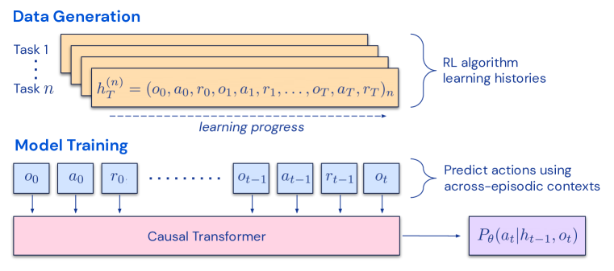
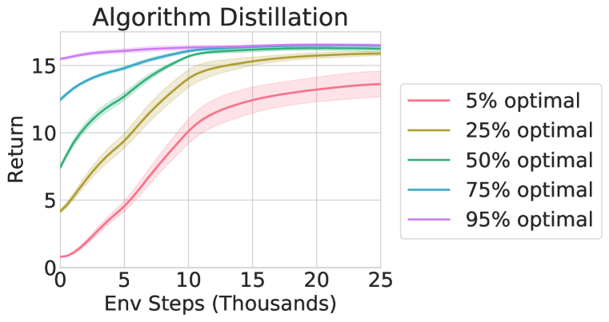

# 用算法蒸馏实现上下文内强化学习（In-context Reinforcement Learning with Algorithm Distillation）

> Source: https://arxiv.org/abs/2210.14215
> Collected: 2026-05-19
> Published: 2022-10-25（arXiv v1）
> Full text: https://ar5iv.labs.arxiv.org/html/2210.14215

## 论文信息

- **作者**：Michael Laskin、Luyu Wang、Junhyuk Oh、Emilio Parisotto、Stephen Spencer、Richie Steigerwald、DJ Strouse、Steven Hansen、Angelos Filos、Ethan Brooks、Maxime Gazeau、Himanshu Sahni、Satinder Singh、Volodymyr Mnih
- **机构**：DeepMind
- **arXiv 编号**：2210.14215
- **版本历史**：v1 2022-10-25
- **会议**：ICLR 2023

## 摘要

提出 **Algorithm Distillation（AD）**：用因果序列模型对强化学习算法的训练历史建模，从而把 RL 算法蒸馏进神经网络。AD 把"学会强化学习"视为**跨 episode 的序列预测问题**：先用源 RL 算法生成学习历史数据集，再训练因果 transformer——以前序学习历史为上下文、自回归预测动作。与蒸馏"学成后/专家序列"的序列策略预测架构不同，AD 完全**在上下文内**改进策略、不更新网络参数。在稀疏奖励、组合任务结构、像素观察等多类环境中，AD 能在上下文内强化学习，且学到比生成源数据的算法更**数据高效**的 RL 算法。

## 分章节总结

### 1 引言

- Transformer 预训练后能经 prompt/in-context learning 适配下游任务。近期工作把离线 RL 当序列预测问题，用 transformer 学单任务/多任务策略——本文统称 **Offline Policy Distillation（PD）**。
- PD 的重大缺陷：所得策略**不会**随更多环境交互增量改进（如 MGDT 靠微调权重适配新任务、Gato 靠专家演示 prompt）。PD 学到的是策略，而非 RL 算法。
- 关键观察：RL 算法训练内在的序列性，使"把强化学习过程本身建模为因果序列预测"成为可能。若 transformer 上下文长到能包含"因学习更新而产生的策略改进"，它就能表征**策略改进算子**（通过关注此前 episode 的状态/动作/奖励）。
- 提出 **AD**：在 RL 算法的学习历史上优化因果序列预测损失，学到一个上下文内的策略改进算子。两部分：(1) 保存源 RL 算法在许多单任务上的训练历史构成多任务数据集；(2) transformer 以前序学习历史为上下文因果建模动作。**上下文必须足够大（跨 episode）**才能捕捉训练数据中的改进。AD 是首个用模仿损失对离线数据做序列建模、实现上下文内强化学习的方法。

### 2 背景

- POMDP：智能体收到只含部分状态信息的观察 $o$（目标信息缺失需经奖励+记忆推断，或像素观察，或两者）。
- 在线/离线 RL：最大化回报 $\sum_t\gamma^t r_t$；离线 RL 从他者收集的 $(s,a,r)$ 数据中提取策略。
- 自注意力/Transformer：$\text{Attention}(Q,K,V)=\text{softmax}(QK^T/\sqrt D)V$，常用掩码 token 或因果下一 token 预测做自监督预训练。
- Offline Policy Distillation（PD）：用序列模型在离线数据上预测动作（行为克隆）+ return 条件或过滤次优数据，从单任务扩展到多任务。
- In-context learning：从上下文推断任务（区分 in-weights：带参数更新的梯度学习；in-context：无梯度、从上下文学习）。

### 3 方法

- 把智能体动作视为其历史 $h_t=(o_{\le t},r_{\le t},a_{\le t})$ 的函数；长（跨 episode）历史条件策略即"算法" $P:\mathcal{H}\cup\mathcal{O}\to\Delta(\mathcal{A})$。算法可像策略一样在环境中展开。
- **Algorithm Distillation**：源算法 $P^{\text{source}}$ 在 $N$ 个任务上产生学习历史数据集 $\mathcal{D}$（式5）；用 NLL 损失把源算法行为蒸馏进序列模型 $P_\theta$：$\mathcal{L}(\theta)=-\sum_n\sum_t\log P_\theta(a_t^{(n)}\mid h_{t-1}^{(n)},o_t^{(n)})$。因源策略在历史中持续改进，准确预测动作要求模型不仅推断当前策略、还要推断改进后的策略，从而蒸馏出**策略改进算子**。
- **Algorithm 1** 三部分：(1) 数据生成——对每个随机采样任务训练单任务梯度型 RL 直至收敛、保存学习历史；(2) 算法蒸馏——随机采长度 $c$ 的跨 episode 子序列，自回归预测动作、反传更新 transformer；(3) 自回归评估——在测试任务上展开 $P_\theta$、把转移存入上下文队列、度量每 episode 回报。
- **实践**：数据生成对 RL 算法无关（蒸馏过 UCB、on-policy actor-critic、off-policy DQN）；序列模型用 GPT 因果 transformer（也兼容 RNN/LSTM，但效果较弱）；因 transformer 复杂度对序列长度平方，采样跨 episode 子序列而非全历史。

### 4 实验设置

- **环境**（须无法靠预训练后零样本泛化解决、支持多任务、任务不能从观察轻易推断、episode 够短）：Adversarial Bandit（10 臂 100 试，评估时奖励分布 OOD 翻转）、Dark Room（9×9 POMDP 推断目标；Hard 变体 17×17 稀疏奖励）、Dark Key-to-Door（先找隐形钥匙再开隐形门，$81^2=6561$ 组合任务）、DMLab Watermaze（像素 3D，连续目标空间无限任务）。
- **基线**：Expert Distillation（ED，同 AD 但源数据仅专家轨迹，类似 Gato）；Source Algorithm（生成数据的梯度型源 RL，从零跑作数据效率对比）；RL²（在线 meta-RL，可训练时交互，作 AD 的近似性能上界）。
- **评估**：预训练后 transformer 完全在上下文内强化学习（不更新参数），自填上下文（无演示）。每环境 5 训练种子 ×20 评估种子（共 100），Dark/Watermaze 各评 1000/160 episode。

### 5 实验（按研究问题）

- **Adversarial Bandit**：AD 与 RL² 都能在上下文内学分布内任务，但 **AD 在 OOD 上泛化更好**；ED 在分布内外都差。AD 展现探索、信用分配、接近 UCB 的 OOD 泛化。
- **AD 是否展现上下文内强化学习？** Dark Room/Key-to-Door 用 A3C（100 actor，2000 历史）、Watermaze 用分布式 DQN（16 actor，4000 历史）。AD 在所有环境上下文内强化学习；ED 多数失败。AD 在 Dark 环境匹配渐近 RL²，Watermaze 上接近（差 13% 内）。信用分配（仅条件单步奖励仍能最大化）、探索（Hard 稀疏奖励仍从此前 episode 推断目标）、泛化（Key-to-Door 6.5k 任务训练仅见 <2k，评估近最优）。
- **能否从像素观察学习？** Watermaze（像素、部分可观察）AD 用上下文内 RL 最大化回报，ED 不学习。
- **AD 能否比源算法更数据高效？** 是，显著更高效——源算法（A3C/DQN）是分布式多流，AD 把多流蒸馏成单流，单流仍达多流性能故更数据高效；对单流算法每隔 $k=10$ episode 子采样也仍更高效。代价：源算法渐近性能略高，但源算法每任务一套权重，AD 是单一通才（固定 $\theta$ 跨所有任务）。
- **能否用演示加速 AD？** 用测试集中从近随机到近专家的策略预填上下文：ED 仅维持输入策略表现，**AD 把每个输入策略在上下文内提升至近最优**，且输入越优 AD 提升越快。
- **上下文需多大？** 多 episode（2–4 个 episode）上下文才能学到近最优上下文内 RL 算法；上下文约一个 episode 长时开始出现初步迹象。

### 6 相关工作

- **Offline Policy Distillation**：Decision Transformer / Trajectory Transformer（单任务）、MGDT / Gato（多任务），但它们上下文远小于一个 episode，故未观察到上下文内 RL，需靠微调或专家演示适配；AD 无需微调与演示。
- **Meta-RL**：AD 属上下文内**离线** meta-RL，梯度无关；区别于在线多 episode 价值函数法与优化型（MAML 等）。
- **Transformer 上下文内学习**：区分"从给定 prompt/演示学"与"从自身试错增量学"；AD 属后者（少见）。

### 7 结论

AD 用因果 transformer 建模 RL 学习历史，把 in-weights RL 算法蒸馏为上下文内 RL 算法，并能学到比源数据生成算法更数据高效的算法。主要局限：多数 RL 环境 episode 长，建模多 episode 上下文需比本文更强的长程序列模型。

## 关键图表

### 图1：算法蒸馏方法

(i) 从解不同任务的单任务 RL 算法收集学习历史 $h_T^{(n)}=(o_0,a_0,r_0,\dots,o_T,a_T,r_T)_n$（横向是学习进展）；(ii) 因果 transformer 用跨 episode 上下文从这些历史预测动作 $P_\theta(a_t\mid h_{t-1},o_t)$。AD 建模 state-action-reward token，不条件于 return。

### 图5：用演示预填上下文时 AD 持续改进输入策略

在 Dark Room 上用源算法历史中不同点（5%/25%/50%/75%/95% 最优）的策略预填上下文：ED 仅维持输入策略，AD 把每条都在上下文内提升至近最优，且输入越优提升越快。

> 主结果（图4）在论文中按环境拆为多个子图（Dark Room / Dark Room Hard / Dark Key-to-Door / Watermaze），结论：AD 在所有环境上下文内强化学习且比 A3C/DQN 源算法更数据高效；ED 基本不学习；RL²（10 亿步）作近似上界。完整子图见 Full text 链接。

## 参考文献

完整参考文献见 Full text 链接。正文重点引用：Vaswani et al. 2017（Transformer）、Brown et al. 2020（GPT-3 / in-context learning）、Chen et al. 2021（Decision Transformer）、Lee et al. 2022（MGDT）、Reed et al. 2022（Gato）、Janner et al. 2021（Trajectory Transformer）、Duan et al. 2016（RL²）、Mnih et al. 2013/2016（DQN / A3C）、Lai & Robbins 1985（UCB）、Morris 1981（Watermaze）、Beattie et al. 2016（DMLab）。
