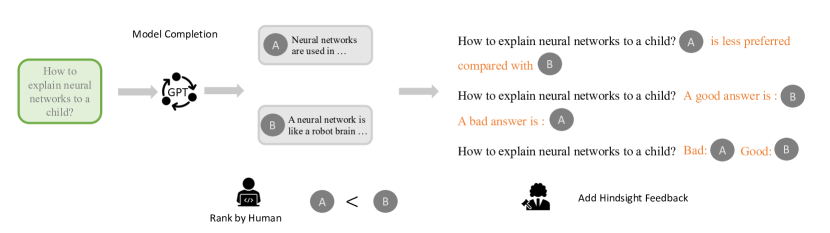
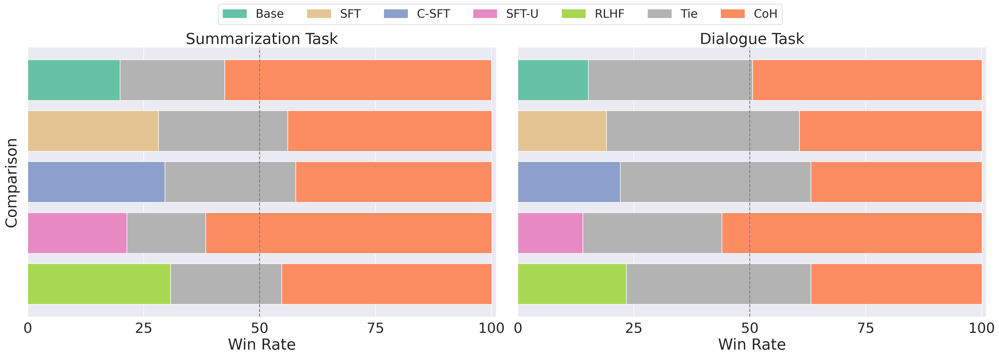

# 后见之明链使语言模型对齐反馈（Chain of Hindsight Aligns Language Models with Feedback）

> Source: https://arxiv.org/abs/2302.02676
> Collected: 2026-05-19
> Published: 2023-02-06（arXiv v1；共 8 版，末版 2023-10-18）
> Full text: https://arxiv.org/html/2302.02676

## 论文信息

- **作者**：Hao Liu、Carmelo Sferrazza、Pieter Abbeel
- **机构**：UC Berkeley
- **arXiv 编号**：2302.02676
- **版本历史**：v1 2023-02-06；…；末版 2023-10-18（共 8 版）
- **会议**：ICLR 2024
- **代码**：https://github.com/lhao499/chain-of-hindsight

## 摘要

从人类偏好学习对语言模型贴合人类需求与价值观很重要。先前方法要么基于人工挑选的、被标注者偏好的模型生成（数据利用低效、难通用），要么依赖强化学习（受不完美奖励函数困扰、优化极难）。本文提出 **Chain of Hindsight（CoH）**：易优化、可从任何形式与极性的反馈学习。灵感来自人类从大量语言形式反馈中学习——把所有反馈转成句子序列，用以微调模型，从而利用 LM 的语言理解能力。把模型条件于"一系列模型生成 + 对应反馈"，使模型学会据反馈生成输出，同时识别并纠正负面属性或错误。应用于大 LM 时，CoH 在摘要与对话基准上显著超过此前方法，人评中明显更受偏好。

## 分章节总结

### 1 引言

- 对齐人类价值的关键是用人类反馈。已有成功主要靠 SFT 与 RLHF，但各有局限：SFT 依赖人工标注 + 仅用正评数据，标注昂贵、且只用正评限制了识别/纠正负面属性的泛化能力；RLHF 可用全部数据但需学奖励函数（易错位/不完美）、RL 优化困难。
- 关键想法：人能从比较形式的丰富反馈中学习。假设：把 LM 条件于"一系列生成 + 反馈"并据此训练，可学会识别并纠正错误与负面属性。
- 方法：把所有人类反馈转为序列，微调模型预测输出、同时条件于一个或多个模型输出及其相对其他输出的比较反馈。训练时给 'Bad'/'Good' 等反馈，模型学习预测更贴合反馈的输出；也支持自然语言反馈。推理时用 'Good' 正反馈引导模型生成期望输出。命名 **Chain of Hindsight（CoH）**——条件于一串"后见之明"反馈。
- 贡献：(a) 新框架 CoH，无需 RLHF 即有效利用全部反馈数据，训练目标与预训练一致、易训练可扩展；(b) 大量实验对比包括 SOTA RLHF 的基线。

### 2 Chain of Hindsight

- **把所有反馈变成序列**：用因果 decoder-only Transformer。标准因果 LM 目标 $\log p(\mathbf{x})=\log\prod_i p(x_i|\mathbf{x}_{<i})$。CoH 把多个模型输出 + 基于人类评分生成的反馈指令组合成 $\mathbf{x}$ 做指令微调。例："How to explain neural networks to a 6 year old? Bad: {差答案} Good: {好答案}."；也支持自然语言反馈（"A good summary: {positive}, a worse summary: {negative}"）。本研究用基于评分的模板化反馈而非在线开放式反馈。
- **掩码**：只对模型生成的非反馈 token 计损失：$\log p(\mathbf{x})=\log\prod_i \mathbb{1}_{O(x)}(x_i)\,p(x_i|[x_j]_{j=0}^{i-1})$（$\mathbb{1}$ 在 $x_i$ 非反馈部分时为 1）。否则会损害推理时生成。
- **Algorithm 1**：每轮从反馈数据集采 minibatch 模型输出及评分→据评分组合成训练序列→指令微调。损失用交叉熵，对最后一个模型输出序列每步平均。
- **防"复制"**：偏好学习中正负样本常相似（如 Anthropic HH），CoH 条件于一例预测另一例时模型可能直接"复制"。对策：训练时随机掩码 0%–5% 过去 token 做正则；并加最大化预训练数据似然的正则项以保通用语言建模能力（该技术对所有基线同样应用）。
- **与先前范式关系**：相比 SFT（仅正评），CoH 用正+非正评 + 反馈输入信息更广；相比 Conditional SFT（类 Decision Transformer，反馈作前缀），CoH 用"反馈-样例对的序列"条件信息更全；SFT-U（对负评加 unlikelihood 损失）；相比 RLHF，CoH 训练更简单且实验中一致更优。

### 3 评估设置

- **训练数据集（3 个）**：WebGPT（19,578 对比较）、Anthropic HH（人评对话对）、Summarization（人选更优摘要）。
- **基准与指标**：摘要——TL;DR（Stiennon 等过滤版 123,169 帖），自动 ROUGE + 人评 accuracy/coherence/coverage；对话——HH 验证集，分类哪条对话更优，指标 helpful/harmless。对话评估用"伪对话"（用模型输出替换历史对话中模型回复）以复用人类数据。
- **基线**：SFT、SFT-U、C-SFT、RLHF（PPO 实现，调优超参）。基座用 GPT-J 6B 与 OPT。

### 4 结果

- **摘要**：ROUGE 上 CoH 大幅超所有基线（含 RLHF，RLHF 第二、C-SFT 紧随）。人评（75 名标注者两两对比，见表1）：CoH 对 Base/SFT/C-SFT/SFT-U/RLHF 平均胜率均显著领先（vs RLHF 平均 45.3% vs 30.8%）。
- **对话（HH）**：分类偏好对话准确率，SFT 大幅超 base，加 unlikelihood 反而降，C-SFT 优于 SFT，RLHF 第二、被 CoH 大幅超越。人评见表2。
- **语言反馈消融**：CoH w/o LF（仅二元反馈）也大幅超 RLHF；加自然语言反馈进一步提升（含 LF 偏好 14.1% vs 不含 11.6%）。
- **模型规模趋势**：小模型 CoH 略逊 SFT，但随规模增大 CoH 一致超过所有 SFT/RLHF，呈正向 scaling。
- **对比 ChatGPT 蒸馏**：与用 ShareGPT 做 SFT 的 Koala 比，CoH 与 Koala 相当，CoH+Koala 组合超过 Koala；C-SFT/SFT 明显落后 Koala。

### 5 相关工作

- **从后见之明学习**：源于目标条件 RL 的 hindsight experience replay（HER，回溯重标奖励/转移以从稀疏反馈学）；本文把"从后见之明链 + 人类反馈学习"用于让模型从错误中学习并修正生成。

### 6 结论

CoH 受"人类从比较形式丰富反馈学习"启发，把 LM 条件于一串后见之明反馈，无视偏好分数地利用所有样例，在摘要与对话上大幅超 RLHF 与其他基线。局限：多反馈实例时序列长、训练算力增加；评估重度依赖昂贵的人类标注。未来：整合外部环境反馈（如单元测试）、在线偏好学习迭代改进。

## 关键图表

### 图2：CoH 构造方法

向 GPT 提问 → 模型生成多个回复（A、B…）→ 人类排序（A 不如 B）→ 把人类偏好转成自然语言反馈并与模型输出组合成 CoH 序列（如 "A is less preferred compared with B"、"A bad answer is A, a good answer is B"、"Bad: A Good: B"）→ 用这些序列做与预训练同目标的微调。

### 图1：人评两两胜率（核心结果）

摘要（左）与对话（右）任务上，CoH 与 Base/SFT/C-SFT/SFT-U/RLHF 两两对比的 Win Rate（含 Tie）。CoH 在所有对比中均明显占优。

### 表1：摘要任务人评胜率（%）

| 对比 | 维度 | 基线 | Tie | CoH | Δ |
|---|---|---|---|---|---|
| vs Base | Average | 19.9 | 22.6 | 57.5 | 37.6 |
| vs SFT | Average | 28.2 | 27.9 | 44.0 | 15.8 |
| vs C-SFT | Average | 29.6 | 28.2 | 42.3 | 12.7 |
| vs SFT-U | Average | 21.4 | 17.0 | 61.7 | 40.3 |
| vs RLHF | Average | 30.8 | 24.0 | 45.3 | 14.5 |

（各对比另含 Accuracy/Coherence/Coverage 三细分维度，此处取 Average 行；完整见 Full text。）

### 表2：对话任务人评胜率（%）

| 对比 | 维度 | 基线 | Tie | CoH | Δ |
|---|---|---|---|---|---|
| vs Base | Average | 15.2 | 35.3 | 49.5 | 34.4 |
| vs SFT | Average | 19.1 | 41.5 | 39.4 | 20.3 |
| vs C-SFT | Average | 22.1 | 41.0 | 36.8 | 14.7 |
| vs SFT-U | Average | 13.9 | 30.0 | 56.0 | 42.1 |
| vs RLHF | Average | 23.4 | 39.8 | 36.9 | 13.5 |

### 表3：自然语言反馈消融（摘要，人评平均胜率 %）

| A | Tie | B |
|---|---|---|
| RLHF 30.8 | 24.0 | CoH 45.3 |
| RLHF 32.1 | 26.5 | CoH w/o LF 42.4 |
| CoH w/o LF 10.6 | 74.3 | CoH 15.1 |

## 参考文献

完整参考文献见 Full text 链接。正文重点引用：Stiennon et al.（summarize from feedback / TL;DR 过滤版、RLHF）、Ouyang et al.（InstructGPT / RLHF）、Nakano et al.（WebGPT 数据）、Bai et al.（Anthropic HH 数据）、Chen et al.（Decision Transformer，Conditional SFT 类比）、Welleck et al.（unlikelihood 训练）、Andrychowicz et al.（HER 后见之明经验回放）、Schulman et al.（PPO）、Geng et al.（Koala）。
