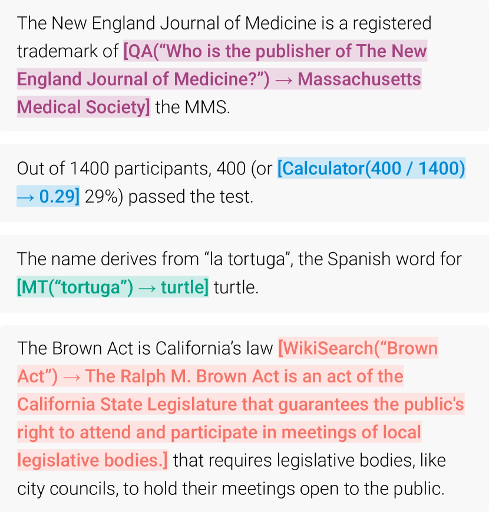

# Toolformer：语言模型可以自学使用工具（Toolformer: Language Models Can Teach Themselves to Use Tools）

> Source: https://arxiv.org/abs/2302.04761
> Collected: 2026-05-19
> Published: 2023-02-09（arXiv v1）
> Full text: https://ar5iv.labs.arxiv.org/html/2302.04761

## 论文信息

- **作者**：Timo Schick、Jane Dwivedi-Yu、Roberto Dessì、Roberta Raileanu、Maria Lomeli、Luke Zettlemoyer、Nicola Cancedda、Thomas Scialom
- **机构**：Meta AI Research、Universitat Pompeu Fabra
- **arXiv 编号**：2302.04761
- **版本历史**：v1 2023-02-09
- **会议**：NeurIPS 2023

## 摘要

LM 能从少量示例或文本指令学新任务，却在算术、事实查询等基础功能上不如更小更简单的模型。本文展示 LM 可通过简单 API **自学使用外部工具**、兼得两者之长。提出 **Toolformer**：训练模型决定调用哪些 API、何时调用、传什么参数、如何把结果融入后续 token 预测。整个过程是**自监督**的，每个 API 仅需少量演示。纳入的工具包括计算器、问答系统、搜索引擎、翻译系统、日历。Toolformer 在多种下游任务上零样本性能大幅提升、常与远更大的模型相当，且不损失核心语言建模能力。

## 分章节总结

### 1 引言

- 大 LM 的固有局限（仅靠继续放大无法根治）：无法获取近期信息、易幻觉、低资源语言弱、缺精确计算能力、不感知时间进展。
- 一个简单出路：让 LM 会用搜索/计算器/日历等外部工具。但已有方法要么依赖大量人工标注，要么把工具用法限定在特定任务，阻碍广泛采用。
- Toolformer 的两条 desiderata：(1) 工具用法应**自监督**学习，无需大量人工标注（成本高，且人觉得有用的未必模型觉得有用）；(2) LM 不损失通用性，自行决定何时、如何、用哪个工具。
- 方法基于"用大 LM 的 in-context learning 从零生成数据集"：给少量人写的 API 用法示例，让 LM 给大规模语料标注潜在 API 调用，用自监督损失筛出真正有助于预测后续 token 的调用，再用这些有用调用微调 LM 自身。基于 6.7B 的 GPT-J。

### 2 方法

- 要求每个 API 的输入输出都能表示为文本序列，用特殊 token 标记调用起止。API 调用记为 $c=(a_c,i_c)$（名称、输入），线性化：`e(c)=<API> a_c(i_c) </API>`，含结果：`e(c,r)=<API> a_c(i_c)→r </API>`（实践中用 `[` `]` `->`，不改词表）。
- 把纯文本数据集 $\mathcal{C}$ 转为带 API 调用的 $\mathcal{C}^*$，三步（图2）：
  1. **采样 API 调用**：为每个 API 写提示 $P(\mathbf{x})$。先对每个位置 $i$ 算 $p_i=p_M(\texttt{<API>}\mid P(\mathbf{x}),x_{1:i-1})$，按阈值 $\tau_s$ 保留 top-$k$ 位置；每个位置采样至多 $m$ 个候选调用。
  2. **执行 API 调用**：依 API 而定（调另一神经网络、跑 Python、检索等），响应须为单一文本序列 $r_i$。
  3. **过滤 API 调用**：定义加权交叉熵损失 $L_i$。比较 $L_i^+$（给定调用+结果作前缀）与 $L_i^-$（不调用 与 仅调用不给结果 两者取小）。仅保留 $L_i^- - L_i^+ \ge \tau_f$ 的调用——即"加入调用及结果"至少把后续 token 损失降低 $\tau_f$。
- **微调**：把保留的调用按原位插回原文得 $\mathbf{x}^*$，构成 $\mathcal{C}^*$，用标准语言建模目标微调 $M$。$\mathcal{C}^*$ 除插入的调用外文本与 $\mathcal{C}$ 完全相同，故不损通用性；调用恰好插在对预测有帮助的位置，使模型据自身反馈学会何时如何用工具。
- **推理**：常规解码直到模型产生 `→`，中断、调对应 API 取响应、插入响应与 `</API>` 后继续解码。

### 3 工具（5 个）

约束：输入输出可文本化、有少量用法演示。

- **问答**：基于检索增强 LM Atlas（在 Natural Questions 上微调），答简单事实问题。
- **计算器**：仅四则运算，结果保留两位小数。
- **Wikipedia 搜索**：BM25 检索器（索引 KILT 的 Wikipedia dump），返回短片段，比 QA 工具信息更全但需模型自行抽取。
- **机器翻译**：600M NLLB（200 语言），fastText 自动检测源语言，目标恒为英语。
- **日历**：无输入，返回当前日期，提供时间上下文。

### 4 实验

#### 4.1 实验设置

- 语料 $\mathcal{C}$ 用 CCNet 子集，$M$ 用 GPT-J。用启发式取更可能有用的子集（如计算器只考虑含 ≥3 个数字的文本）以降标注成本。权重函数 $\tilde w_t=\max(0,1-0.2t)$ 使调用靠近信息真正有用处。阈值 $\tau_s,\tau_f$ 按工具单独选。

#### 4.2 下游任务（全部 prompted zero-shot，无 in-context 示例）

- 解码改动：当 `<API>` 在前 $k=10$ 个最可能 token 内即可起调用（$k=1$ 为常规贪心），每输入至多 1 次调用以防死循环。
- **LAMA**（SQuAD/Google-RE/T-REx，填缺失事实；禁用 Wikipedia 搜索避免不公平）：Toolformer 较最佳同规模基线分别 +11.7/+5.2/+18.6，超过 OPT-66B 与 GPT-3-175B；98.1% 例自主调用 QA 工具。
- **数学**（ASDiv/SVAMP/MAWPS）：即便禁用调用 Toolformer 已更强（微调副益）；开启调用后所有任务性能翻倍以上，97.9% 例调用计算器，超 OPT/GPT-3。
- **问答**（WebQS/NQ/TriviaQA；禁用 QA 工具）：超同规模基线，99.3% 例用 Wikipedia 搜索；但仍逊于 GPT-3-175B（搜索引擎简单、且不能改写查询/浏览多结果）。
- **多语种问答**（MLQA，问题为阿/德/西/印地/越/简中）：调用一致提升各语言，翻译工具使用率 63.8%–94.9%（印地语例外仅 7.3%）；但不一致优于原始 GPT-J（部分语言上 CCNet 微调因分布偏移反降）。

#### 4.3 语言建模

- 在 WikiText 与未训练 CCNet 子集上测困惑度。在 $\mathcal{C}^*$ 上训练（推理时禁用调用）相比在 $\mathcal{C}$ 上训练**不增加困惑度**——加入 API 调用对无调用的语言建模零代价。

#### 4.4 缩放律

- 把方法用于 GPT-2 家族（124M/355M/775M/1.6B）与 GPT-J，仅用 QA/计算器/Wikipedia 三工具。利用工具的能力约在 **775M 参数**才涌现；更小模型用不用工具表现相近（Wikipedia 搜索是例外，较易用）。即便最大模型，有/无调用之间仍存在大差距。

### 5 分析

- **解码策略**：增大 $k$ 使更多例发生调用（T-REx/WebQS 从 $k=1$ 的 40.3%/8.5% 升到 $k=10$ 的 98.1%/100%）。$k=1$ 时模型有一定校准性——它倾向于在"不调用会表现特别差"的例上调用；高 $k$ 时该校准丢失。

### 7 局限

- 不能**链式**用工具（各 API 调用独立生成，微调集无链式样本）；不能**交互式**用工具（如搜索结果浏览/查询改写）；对输入措辞敏感；样本效率低（处理 >100 万文档仅得几千条有用计算器调用）；决定是否调用时未计入工具的计算成本。

### 8 结论

Toolformer 以自监督方式学会经简单 API 调用使用搜索/计算器/翻译等工具，靠"是否降低后续 token 困惑度"过滤采样到的调用并微调。它大幅提升 6.7B GPT-J 的零样本性能，在一系列任务上甚至超过远更大的 GPT-3。

## 关键图表

### 图1：Toolformer 的 API 调用预测示例

模型自主决定调用不同 API（问答、计算器、机器翻译、Wikipedia 搜索）以获取补全文本所需信息，调用与结果内联在文本中。

### 图2：方法三步（以问答工具为例）

给定输入文本 $\mathbf{x}$：(1) 采样位置 $i$ 与候选调用 $c_i^1,\cdots,c_i^k$；(2) 执行这些调用得结果；(3) 过滤掉不降低后续 token 损失 $L_i$ 的调用。剩余调用与原文交错，得到带 API 调用的新文本 $\mathbf{x}^*$。

### 表1：所有 API 的输入输出示例

| API | 示例输入 | 示例输出 |
|---|---|---|
| Question Answering | Where was the Knights of Columbus founded? | New Haven, Connecticut |
| Wikipedia Search | Fishing Reel Types | Spin fishing … open faced reel and the closed faced reel. |
| Calculator | 27 + 4 * 2 | 35 |
| Calendar | （空） | Today is Monday, January 30, 2023. |
| Machine Translation | sûreté nucléaire | nuclear safety |

### 表3：LAMA 子集结果

| Model | SQuAD | Google-RE | T-REx |
|---|---|---|---|
| GPT-J | 17.8 | 4.9 | 31.9 |
| GPT-J + CC | 19.2 | 5.6 | 33.2 |
| Toolformer (disabled) | 22.1 | 6.3 | 34.9 |
| Toolformer | 33.8 | 11.5 | 53.5 |
| OPT (66B) | 21.6 | 2.9 | 30.1 |
| GPT-3 (175B) | 26.8 | 7.0 | 39.8 |

### 表4：数学推理结果

| Model | ASDiv | SVAMP | MAWPS |
|---|---|---|---|
| GPT-J | 7.5 | 5.2 | 9.9 |
| GPT-J + CC | 9.6 | 5.0 | 9.3 |
| Toolformer (disabled) | 14.8 | 6.3 | 15.0 |
| Toolformer | 40.4 | 29.4 | 44.0 |
| OPT (66B) | 6.0 | 4.9 | 7.9 |
| GPT-3 (175B) | 14.0 | 10.0 | 19.8 |

### 表5：问答结果

| Model | WebQS | NQ | TriviaQA |
|---|---|---|---|
| GPT-J | 18.5 | 12.8 | 43.9 |
| GPT-J + CC | 18.4 | 12.2 | 45.6 |
| Toolformer (disabled) | 18.9 | 12.6 | 46.7 |
| Toolformer | 26.3 | 17.7 | 48.8 |
| OPT (66B) | 18.6 | 11.4 | 45.7 |
| GPT-3 (175B) | 29.0 | 22.6 | 65.9 |

### 表8：语言建模困惑度

| Model | WikiText | CCNet |
|---|---|---|
| GPT-J | 9.9 | 10.6 |
| GPT-J + CC | 10.3 | 10.5 |
| Toolformer (disabled) | 10.3 | 10.5 |

## 参考文献

完整参考文献见 Full text 链接。正文重点引用：Brown et al. 2020（GPT-3 / in-context learning）、Wang & Komatsuzaki 2021（GPT-J）、Izacard et al. 2022（Atlas QA）、Costa-jussà et al. 2022（NLLB 翻译）、Petroni et al. 2019/2021（LAMA / KILT）、Schick & Schütze 2021（自举数据生成）、Nakano et al. 2021（WebGPT 交互式检索）、Wei et al. 2022（涌现能力）。
