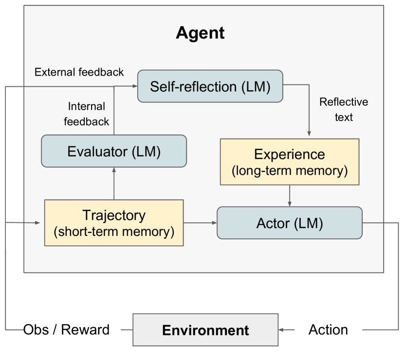

# Reflexion：具备言语强化学习的语言智能体（Reflexion: Language Agents with Verbal Reinforcement Learning）

> Source: https://arxiv.org/abs/2303.11366
> Collected: 2026-05-19
> Published: 2023-03-20（arXiv v1；v4 2023-10-10）
> Full text: https://arxiv.org/html/2303.11366

## 论文信息

- **作者**：Noah Shinn、Federico Cassano、Edward Berman、Ashwin Gopinath、Karthik Narasimhan、Shunyu Yao
- **机构**：东北大学、MIT、普林斯顿大学
- **arXiv 编号**：2303.11366
- **版本历史**：v1 2023-03-20；v2 2023-05-21；v3 2023-06-10；v4 2023-10-10
- **会议**：NeurIPS 2023
- **代码**：https://github.com/noahshinn024/reflexion

## 摘要

LLM 越来越多作为目标驱动智能体与外部环境（游戏、编译器、API）交互，但传统强化学习需大量样本与昂贵微调，语言智能体难以快速高效地从试错中学习。本文提出 **Reflexion**：不更新权重、而通过**语言反馈**强化语言智能体的新框架。Reflexion 智能体对任务反馈信号进行口头反思，并把反思文本存入情景记忆缓冲区，以改进后续试验的决策。Reflexion 足够灵活，可纳入多类型（标量或自由文本）与多来源（外部或内部模拟）反馈信号，在序列决策、编码、语言推理多类任务上显著优于基线。例如在 HumanEval 编码基准达 **91% pass@1**，超过此前 SOTA GPT-4 的 80%。并就不同反馈信号、融入方式与智能体类型做消融分析。

## 分章节总结

### 1 引言

- ReAct、SayCan、Toolformer、HuggingGPT、generative agents、WebGPT 等已验证基于 LLM 核心的自主决策智能体可行，但因依赖大模型，至今多只能用 in-context 示例教学（梯度下降式 RL 太耗算力与时间）。
- Reflexion 用**言语强化**帮智能体从过往失败中学习：把环境的二元/标量反馈转成文本摘要，作为下一轮的额外上下文。这种自反思反馈像"语义梯度"，给出具体改进方向，类似人类对失败的反思以形成更优计划。
- 生成有用反思的挑战在于信用分配（credit assignment）+ 生成含可操作洞见的摘要。探索三种方式：简单二元环境反馈、对常见失败的预定义启发式、LLM 自评（决策的二元分类 / 编程的自写单元测试）。评估信号一律放大为自然语言经验摘要存入长期记忆。
- 相对传统策略/价值 RL 的优势：(1) 轻量、不微调 LLM；(2) 支持更细致反馈（如定向动作改动）；(3) 显式可解释的情景记忆；(4) 为后续 episode 提供更明确的行动提示。劣势：依赖 LLM 自评能力（或启发式）、无成功的形式化保证。
- 贡献：提出 Reflexion 言语强化新范式（策略 = 智能体记忆编码 + LLM 参数）；实证自反思对少数几轮内学复杂任务极有用；提出 **LeetcodeHardGym**（40 道 hard 级 Leetcode、19 种语言的代码生成 RL gym）；在多任务上超强基线并达多个代码生成 SOTA。

### 2 相关工作

- **推理与决策**：Self-Refine（迭代自精修，限单次生成推理）、Pryzant et al. 2023（语义提示优化，限单次）、Paul et al. 2023（微调 critic 给轨迹内反馈）、Xie et al. 2023（随机 beam search 决策）、Kim et al. 2023（固定步数重试无评估）。Reflexion 用自反思构建"持久的自反思经验记忆"，让智能体识别自身错误并自我提炼教训。
- **编程**：AlphaCode（隐藏测试评估）、CodeT（自生成单测打分）、Self-Debugging（据执行反馈改实现）、CodeRL（actor-critic RL 调试）。前述多依赖真值测试（使 pass@1 不成立）或不做自反思桥接"错误识别→实现改进"。

### 3 Reflexion：经言语反思的强化

模块化三模型：
- **Actor $M_a$**：基于 LLM，按状态观察生成文本与动作，从策略 $\pi_\theta$ 采样动作 $a_t$、收观察 $o_t$。探索 Chain-of-Thought、ReAct 作为 Actor。带记忆组件 `mem` 提供额外上下文。
- **Evaluator $M_e$**：对生成轨迹打分。推理任务用 EM 评分；决策任务用预定义启发式；也试用另一 LLM 实例作评估器（决策与编程）。
- **Self-Reflection $M_{sr}$**：LLM 实例，给定稀疏奖励信号（如成功/失败二元）、当前轨迹、持久记忆 `mem`，生成细致具体的语言反馈（比标量奖励信息量大），存入 `mem`。例如多步决策失败时可推断某动作 $a_i$ 导致后续错误，口头陈述"本应采取 $a_i'$"并存储，后续试验据此调整。
- **记忆**：短期记忆 = 轨迹历史；长期记忆 = Self-Reflection 输出。两者协同提供既具体又含跨试验教训的上下文。
- **流程（Algorithm 1）**：首轮 Actor 产轨迹 $\tau_0$，Evaluator 给 $r_0=M_e(\tau_0)$，Self-Reflection 分析 $\{\tau_0,r_0\}$ 产摘要 $sr_0$ 存 `mem`；循环直到 Evaluator 判定 $\tau_t$ 正确。`mem` 以最大经验数 $\Omega$（通常 1–3）受限以适配 LLM 上下文上限。

### 4 实验

Reflexion 较强基线提升：AlfWorld +22%、HotpotQA +20%、HumanEval +11%。

#### 4.1 序列决策：ALFWorld

- 134 个 AlfWorld 环境、6 类任务（找隐藏物、移动物体、用物操作物）。用 ReAct 作动作生成器。两种自评：LLM 自然语言分类 + 手写启发式（同动作同响应循环 >3 次，或当前环境动作数 >30 视为低效规划，则触发自反思）。基线触发时直接重置重试；Reflexion 则自反思找错、更新记忆、重置重试。记忆截断为最近 3 条反思。
- **结果**：ReAct+Reflexion 用简单启发式检测幻觉/低效规划，134 个完成 130 个，并在 12 轮连续试验中持续学会更多任务；ReAct-only 在第 6–7 轮间停止增长、收敛于 22% 幻觉率无长期恢复。长期记忆助力两种情形：长轨迹中早期错误易定位；可跨多轮经验彻底搜索房间。

#### 4.2 推理：HotpotQA

- HotpotQA（Wikipedia，113k 问答，多文档推理）。实现 Reflexion+CoT（$Q\to A$ 与 $Q,C_{gt}\to A$，给真值上下文以隔离长文本推理）与 Reflexion+ReAct（Wikipedia API 检索 + 显式思考）。轮间用 EM 二元成功信号，记忆 3 条。
- **结果**：Reflexion 显著超所有基线；ReAct-only/CoT-only/CoT(GT)-only 在后续轮无法概率性改进（首轮失败任务无一被解）。CoT(GT) 因有真值上下文准确率更高但仍有 39% 答错，Reflexion 无真值答案下仍提升 14%。
- **消融**：以 CoT(GT) 为基线，加情景记忆（EPM，含最近轨迹），再加标准自反思。自反思在 EPM 优势之上再带来 **8% 绝对提升**——支持"仅精修不如自反思引导的精修"。

#### 4.3 编程

- MBPP / HumanEval / 新建 LeetcodeHardGym（40 道 GPT-4 预训练截止后发布的 Leetcode hard）；用 MultiPL-E 把 Python 子集译为 Rust，证明语言无关。用 CoT 生成多样测试，过滤语法有效（构 AST）后采样至多 6 条组成测试套件。记忆上限 1 条。
- **结果**：Reflexion 在 Python/Rust 各基准（除 MBPP Python）创 SOTA。深入分析 MBPP Python 较差：其内部测试假阳率 16.3%（HumanEval Python 仅 1.4%），假阳会过早提交错误解。Reflexion 偏好假阴而非假阳（可借自反思识别错误测试、保留原实现）。
- **消融（HumanEval Rust 最难 50 题，GPT-4）**：去测试生成 → 52% 低于基线 60%（无单测无法判断当前实现是否正确，被迫全程编辑造成有害改动）；去自反思 → 不优于基线（测试/编译能抓语法逻辑错，但修复未反映这些指示）。说明"无自反思的盲目试错调试"在难任务上无效。

### 5 局限

- 本质是用自然语言做策略优化，仍可能陷入非最优局部极小。长期记忆限于滑动窗口固定容量（鼓励未来用向量数据库/SQL 等更高级结构）。代码生成上测试驱动开发对非确定函数、纯度不足的 API 交互函数、依硬件/并发的函数难以精确指定输入输出映射。

### 7 结论

Reflexion 让智能体经试验、错误、自反思、持久记忆从过往学习，在决策、推理、编程上均更优，并在多个代码生成基准达 SOTA。

## 关键图表

### 图2：Reflexion 架构

Agent 内：Actor(LM) 生成轨迹（短期记忆）与环境交互产生 Obs/Reward；Evaluator(LM) 据外部/内部反馈打分；Self-reflection(LM) 产出反思文本存入 Experience（长期记忆），反过来指导 Actor。

### 图1：Reflexion 适用三类任务

Reflexion 在决策（4.1）、编程（4.3）、推理（4.2）任务上均通过试验—错误—自反思优化自身行为。

### 表1：各基准 Pass@1 准确率（%）

| Benchmark + Language | Prev SOTA Pass@1 | SOTA Pass@1 | Reflexion Pass@1 |
|---|---|---|---|
| HumanEval (PY) | 65.8 (CodeT + GPT-3.5) | 80.1 (GPT-4) | 91.0 |
| HumanEval (RS) | – | 60.0 (GPT-4) | 68.0 |
| MBPP (PY) | 67.7 (CodeT + Codex) | 80.1 (GPT-4) | 77.1 |
| MBPP (RS) | – | 70.9 (GPT-4) | 75.4 |
| Leetcode Hard (PY) | – | 7.5 (GPT-4) | 15.0 |

### 表2：HumanEval / MBPP 整体准确率与测试生成表现

| Benchmark + Language | Base | Reflexion | TP | FN | FP | TN |
|---|---|---|---|---|---|---|
| HumanEval (PY) | 0.80 | 0.91 | 0.99 | 0.40 | 0.01 | 0.60 |
| MBPP (PY) | 0.80 | 0.77 | 0.84 | 0.59 | 0.16 | 0.41 |
| HumanEval (RS) | 0.60 | 0.68 | 0.87 | 0.37 | 0.13 | 0.63 |
| MBPP (RS) | 0.71 | 0.75 | 0.84 | 0.51 | 0.16 | 0.49 |

TP：单测过且解对；FN：单测败但解对；FP：单测过但解错；TN：单测败且解错。

### 表3：消融（HumanEval Rust 最难 50 题，GPT-4 为基座）

| Approach | Test Generation | Self-reflection | Pass@1 (Acc) |
|---|---|---|---|
| Base model | False | False | 0.60 |
| Test generation omission | False | True | 0.52 |
| Self-reflection omission | True | False | 0.60 |
| Reflexion | True | True | 0.68 |

## 参考文献

完整参考文献见 Full text 链接。正文重点引用：Yao et al. 2023（ReAct）、Wei et al. 2022（Chain-of-Thought）、Madaan et al. 2023（Self-Refine）、Chen et al. 2021（HumanEval/Codex）、Chen et al. 2022（CodeT）、Chen et al. 2023（Self-Debugging）、Shridhar et al. 2021（ALFWorld）、Yang et al. 2018（HotpotQA）、Austin et al. 2021（MBPP）、Cassano et al. 2022（MultiPL-E）、OpenAI 2023（GPT-4）、Sutton & Barto 2018（信用分配）。
