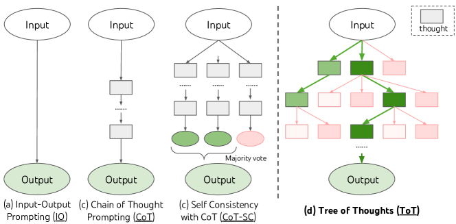
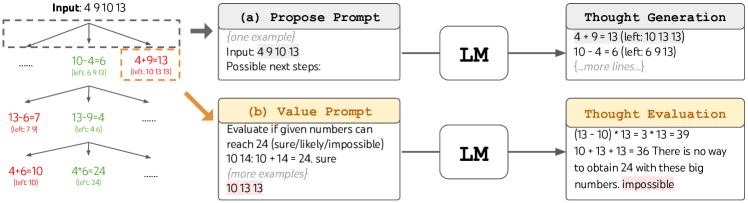

# 思维树：用大语言模型审慎求解问题（Tree of Thoughts: Deliberate Problem Solving with Large Language Models）

> Source: https://arxiv.org/abs/2305.10601
> Collected: 2026-05-19
> Published: 2023-05-17（arXiv v1；v2 2023-12-03 NeurIPS camera-ready）
> Full text: https://arxiv.org/html/2305.10601

## 论文信息

- **作者**：Shunyu Yao、Dian Yu、Jeffrey Zhao、Izhak Shafran、Thomas L. Griffiths、Yuan Cao、Karthik Narasimhan
- **机构**：普林斯顿大学、Google DeepMind
- **arXiv 编号**：2305.10601
- **版本历史**：v1 2023-05-17；v2 2023-12-03（NeurIPS 2023 camera-ready）
- **会议**：NeurIPS 2023
- **代码**：https://github.com/princeton-nlp/tree-of-thought-llm

## 摘要

语言模型在推理时仍受限于 token 级、从左到右的决策过程，在需要探索、策略前瞻、或初始决策起关键作用的任务上表现不足。本文提出新的推理框架 **Tree of Thoughts（ToT）**，把流行的 chain-of-thought 提示一般化，允许在"思考"（连贯文本单元，作为求解的中间步骤）之上做探索。ToT 让 LM 通过考虑多条不同推理路径、自评选择来决定下一步，并在必要时前瞻或回溯以做全局决策。实验表明 ToT 在三个需要非平凡规划或搜索的新任务（Game of 24、Creative Writing、Mini Crosswords）上显著增强问题求解能力。例如 Game of 24 上，GPT-4 用 chain-of-thought 仅解出 4%，而 ToT 达到 **74%**。

## 分章节总结

### 1 引言

- 当前 LM 的进步底层仍是自回归、逐 token、从左到右生成的机制。这是否足以构建通用问题求解器？
- 借鉴人类认知的"双过程"理论：System 1（快、自动、无意识）vs System 2（慢、审慎、有意识）。LM 的关联式 token 选择类似 System 1，可由更审慎的 System 2 规划过程增强：(1) 对当前选择维护并探索多种替代而非只选一个；(2) 评估当前状态、主动前瞻或回溯做更全局的决策。
- 回到 AI/认知科学起源（Newell、Shaw、Simon，1950s）：把问题求解刻画为在树状组合问题空间中的搜索。由此提出 **Tree of Thoughts**，并把 LM 自评/审慎作为搜索启发式（此前启发式要么编程要么学习，用 LM 自评是新的第三条路），结合 BFS/DFS 做带前瞻与回溯的系统探索。
- 提出三个即便用 GPT-4 也难的新任务：Game of 24、Creative Writing、Crosswords。

### 2 背景（形式化已有方法）

- 记预训练 LM 为 $p_\theta$。
- **IO 提示**：$y\sim p_\theta^{IO}(y|x)$，用任务说明/few-shot 包裹输入。
- **CoT 提示**（Wei et al., 2022）：引入思维链 $z_1,\cdots,z_n$ 桥接 $x$ 与 $y$，顺序采样；实践中 $[z_{1\cdots n},y]$ 作为连续序列采样，思考的粒度（短语/句/段）含糊。
- **CoT-SC**（Wang et al., 2022）：采样 $k$ 条独立思维链取最频繁输出；改进 CoT，但链内无局部探索，"最频繁"启发式只在输出空间有限时适用。

### 3 ToT：用 LM 审慎求解问题

- 人类问题求解是在树状问题空间中搜索（节点=部分解，分支=操作），由启发式引导。现有 LM 方法两大缺陷：局部不探索思考过程内的不同延续；全局不含规划/前瞻/回溯。
- ToT 把任何问题表述为对树的搜索，节点为状态 $s=[x,z_{1\cdots i}]$。一个 ToT 实例需回答四问：
  1. **思考分解**：依问题性质设计中间思考步。思考应"足够小"使 LM 能生成有希望且多样的样本，又"足够大"使 LM 能评估其前景（如 Crosswords 一个词、Game of 24 一行方程、Creative Writing 一段写作计划）。
  2. **思考生成器 $G(p_\theta,s,k)$**：(a) 从 CoT 提示独立采样 $k$ 个（思考空间丰富时，如段落）；(b) 用 "propose prompt" 顺序提议（思考空间受限时，如一词/一行，避免重复）。
  3. **状态评估器 $V(p_\theta,S)$**：(a) 独立给每个状态打分（标量 1-10 或 sure/likely/impossible，靠少量前瞻模拟 + 常识）；(b) 跨状态投票选最优（成功难以直接估值时，如段落连贯性，类似 step-wise self-consistency）。可多次提示聚合以更稳健。
  4. **搜索算法**：BFS（Alg.1，每步保留 $b$ 个最优状态，用于树浅的 Game of 24/Creative Writing，$T\le3$）；DFS（Alg.2，优先探索最有希望状态，遇 $V\le v_{th}$ 则剪枝并回溯父节点，用于 Crosswords）。
- ToT 的概念优势：通用性（IO/CoT/CoT-SC/self-refine 均为其特例）、模块化、适应性、便捷（无需额外训练）。

### 4 实验

统一用 Chat Completion 模式 GPT-4，采样温度 0.7（实验于 2023-05-05～16）。

#### 4.1 Game of 24

- **任务**：用 4 个数与 +−×÷ 得到 24。从 4nums.com 取按人类解题时间排序的第 901–1000 号较难局，报 100 局成功率。
- **基线**：IO（5 个 in-context 例）、CoT（每对增补 3 个中间方程）、CoT-SC（100 样本多数）、IO+迭代精修（≤10 轮，用真值反馈）。
- **ToT 设置**：分解为 3 步（每步一个中间方程），BFS 保留 $b=5$，对每个候选用 sure/maybe/impossible 评估（每个采样 3 次）。
- **结果**：IO/CoT/CoT-SC 仅 7.3%/4.0%/9.0%；ToT $b=1$ 已达 45%，$b=5$ 达 74%。CoT(best of 100) 49% 仍远低于 ToT($b>1$)。误差分析：约 60% CoT 样本在生成第一步（前三个词）后即已失败，凸显左到右解码的问题。

#### 4.2 Creative Writing

- **任务**：输入 4 个随机句，输出 4 段、各段分别以这 4 句结尾的连贯文章。开放、探索性，挑战创造性思维与高层规划。
- **评测**：GPT-4 zero-shot 给 1–10 连贯性分（采 5 次取平均，平均标准差约 0.56）+ 作者盲评成对比较。
- **ToT 设置**：深度 2（1 个中间思考步），先生成 $k=5$ 个计划投票选最佳，再据最佳计划生成 $k=5$ 篇文章投票选最佳，$b=1$。
- **结果**：ToT 平均分 7.56 > CoT 6.93 > IO 6.19；人评 100 对中偏好 ToT 41 次、偏好 CoT 21 次（38 对相当）。迭代精修在此自然语言任务上更有效（IO 6.19→7.67，ToT 7.56→7.91），可视为 ToT 框架中第三种思考生成方式（从精修旧思考产生新思考）。

#### 4.3 Mini Crosswords

- **任务**：5×5 小填字（5 横 5 纵线索→25 字母）。从 GooBix 取 156 局，测试用 20 局；按字母/单词/整局三个层级评成功率。
- **ToT 设置**：DFS，后续思考不改已填字母（≤10 个中间步）。生成时把已有思考翻成剩余线索的字母约束、提议 5 次并要求 LM 给置信度、聚合排序；评估时判断每条剩余线索在约束下是否可能填入，任一"不可能"则剪枝回溯。DFS ≤100 步，输出最深探索状态。
- **结果**：IO/CoT 单词级 <16%，ToT 达单词级 60%、解出 4/20 局。Oracle（输出最佳 DFS 状态）解 7/20，说明输出启发式可改进。消融：-prune 普遍更差但能找到 4/20 正确解；-backtrack（贪心 $b=1$，≤20 步允许覆写）仅 20% 单词级，确认回溯重要。

### 5 相关工作

- **规划与决策**：ToT 在每步同时考虑多个可行计划并推进最有希望者，用 LM 自身提供价值估计（区别于 RL 训练专门 reward/policy）；与并发工作 RAP（MCTS）相比任务更难、模块化更强。
- **自反思**：Reflexion / Self-Refine / 自评引导解码等用 LLM 评估自身预测；ToT 的表述比 PAL（思考=代码）更通用，能处理创意写作等任务。
- **程序引导生成 / 经典搜索**：可视为经典搜索（如 A*）的现代演绎，启发式由 LM 自评提供。

### 6 讨论

- **局限与未来**：GPT-4 已擅长的任务未必需要 ToT；本文只探索三个相对简单的挑战任务；搜索方法比采样更耗资源（GPT-4 API 成本），但模块化允许定制性能-成本权衡；本文用现成 LM，用 ToT 式高层反事实决策来微调 LM 是潜在方向。
- **结论**：LM 的关联式 System 1 可由"搜索解路径树"的 System 2 有益增强；ToT 把经典问题求解洞见转化为当代 LM 可用方法，同时 LM 弥补了经典方法在难形式化问题（如创意写作）上的弱点。

## 关键图表

### 图1：四种 LLM 求解范式示意（核心）

每个矩形是一个"思考"（连贯语言序列，求解中间步）。(a) IO 直连；(b) CoT 线性思考链；(c) CoT-SC 多链多数投票；(d) ToT 主动维护思考树，带分支、评估、前瞻与回溯。

### 图2：Game of 24 中的 ToT（提议与评估）

(a) Propose Prompt：给定剩余数字，提示 LM 生成可能的下一步（思考生成）。(b) Value Prompt：提示 LM 评估给定数字能否达到 24（sure/likely/impossible），用作搜索启发式（思考评估）。

### 表1：三个任务概览

| | Game of 24 | Creative Writing | 5x5 Crosswords |
|---|---|---|---|
| 输入 | 4 个数（4 9 10 13） | 4 个随机句 | 10 条线索 |
| 输出 | 得 24 的方程 (13-9)*(10-4)=24 | 以 4 句结尾的 4 段文章 | 5x5 字母 |
| 思考 | 3 个中间方程 | 一份简短写作计划 | 各线索填入的词 |
| ToT 步数 | 3 | 1 | 5-10（可变） |

### 表2：Game of 24 结果

| Method | Success |
|---|---|
| IO prompt | 7.3% |
| CoT prompt | 4.0% |
| CoT-SC (k=100) | 9.0% |
| ToT (b=1) | 45% |
| ToT (b=5) | 74% |
| IO + Refine (k=10) | 27% |
| IO (best of 100) | 33% |
| CoT (best of 100) | 49% |

### 表3：Mini Crosswords 结果（成功率 %）

| Method | Letter | Word | Game |
|---|---|---|---|
| IO | 38.7 | 14 | 0 |
| CoT | 40.6 | 15.6 | 1 |
| ToT (ours) | 78 | 60 | 20 |
| +best state（oracle） | 82.4 | 67.5 | 35 |
| -prune（消融） | 65.4 | 41.5 | 5 |
| -backtrack（消融） | 54.6 | 20 | 5 |

## 参考文献

完整参考文献见 Full text 链接。正文重点引用：Wei et al. 2022（Chain-of-Thought）、Wang et al. 2022（CoT self-consistency）、Newell et al. 1959/1972（问题空间搜索）、Kahneman 2011（System 1/2）、OpenAI 2023（GPT-4）、Hao et al. 2023（RAP，并发）、Shinn et al. 2023（Reflexion）、Madaan et al. 2023（Self-Refine）、Xie et al. 2023（self-eval guided decoding）、Hart et al. 1968（A*）。
