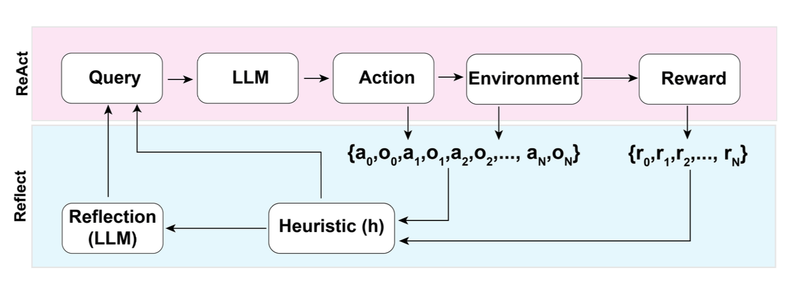
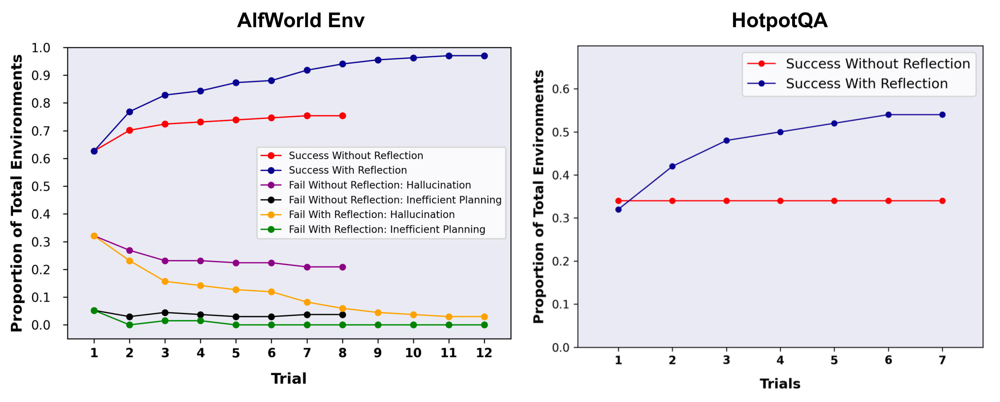
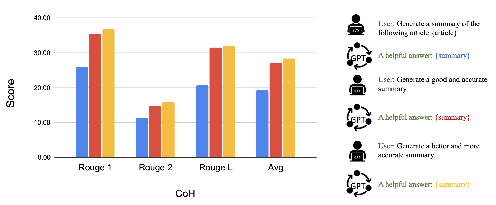
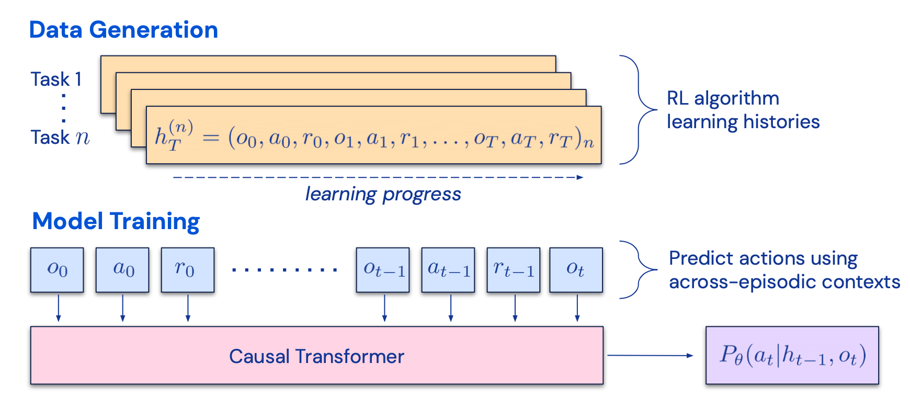
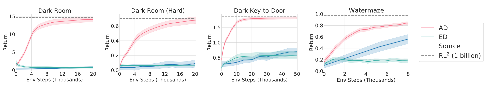
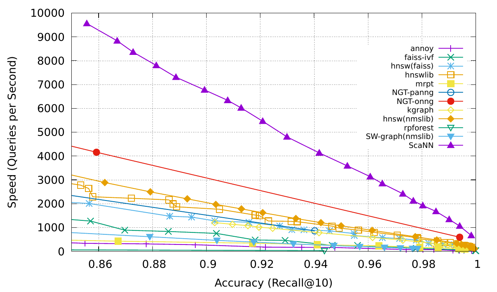
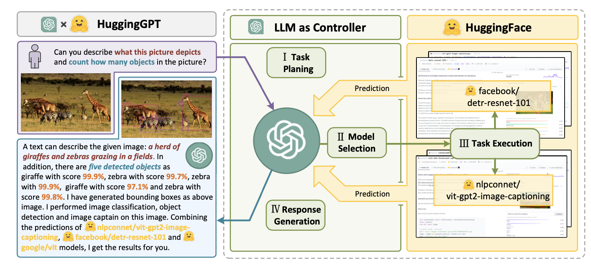
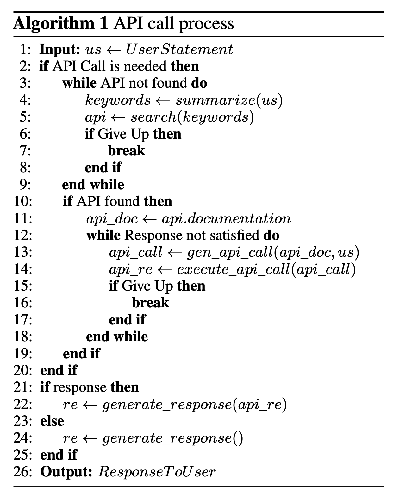
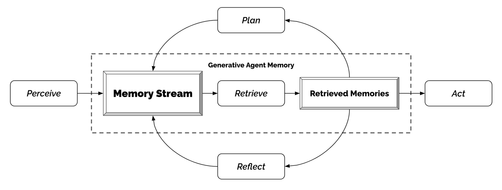

# LLM 驱动的自主智能体（LLM Powered Autonomous Agents）

> Source: https://lilianweng.github.io/posts/2023-06-23-agent/
> Collected: 2026-05-19
> Published: 2023-06-23
> Full text: https://lilianweng.github.io/posts/2023-06-23-agent/

## 文章信息

- **作者**：Lilian Weng（翁丽莲），发布时任 OpenAI Safety / Applied AI 研究团队负责人
- **载体**：个人博客 Lil'Log
- **发布日期**：2023-06-23
- **性质**：综述性博客文章，被广泛引用为 LLM Agent 的经典心智模型

---

以 LLM（大语言模型）作为核心控制器来构建智能体是一个很酷的概念。AutoGPT、GPT-Engineer、BabyAGI 等若干概念验证 demo 都是鼓舞人心的例子。LLM 的潜力不止于生成写得好的文案、故事、文章和程序；它可以被框定为一个强大的通用问题求解器。

# 智能体系统总览（Agent System Overview）

在一个 LLM 驱动的自主智能体系统中，LLM 充当智能体的"大脑"，由若干关键组件补充：

- **规划（Planning）**
  - 子目标与分解：智能体把大任务拆成更小、可管理的子目标，从而高效处理复杂任务。
  - 反思与精炼：智能体能对过去的行动做自我批评与自我反思，从错误中学习并为后续步骤改进，从而提升最终结果质量。
- **记忆（Memory）**
  - 短期记忆：我会把所有的 in-context learning（见 Prompt Engineering）视为利用模型的短期记忆来学习。
  - 长期记忆：为智能体提供在长时间内保留并回忆（无限）信息的能力，通常借助外部向量存储与快速检索实现。
- **工具使用（Tool use）**
  - 智能体学会调用外部 API 来获取模型权重中缺失的额外信息（这些信息在预训练后往往难以更改），包括当前信息、代码执行能力、对专有信息源的访问等。


*LLM 驱动的自主智能体系统总览。*

# 组件一：规划（Component One: Planning）

一个复杂任务通常涉及很多步骤。智能体需要知道这些步骤是什么并提前规划。

## 任务分解（Task Decomposition）

**思维链（Chain of Thought, CoT；Wei et al. 2022）**已成为提升模型在复杂任务上表现的标准提示技术。指示模型"一步步思考（think step by step）"，利用更多测试时计算把困难任务分解为更小更简单的步骤。CoT 把大任务转化为多个可管理的任务，并为解释模型的思考过程提供了一个视角。

**思维树（Tree of Thoughts；Yao et al. 2023）**通过在每一步探索多种推理可能性来扩展 CoT。它先把问题分解为多个思考步骤，并在每一步生成多个想法，形成树状结构。搜索过程可以是 BFS（广度优先）或 DFS（深度优先），每个状态由一个分类器（通过提示）或多数投票来评估。

任务分解可以通过以下方式完成：(1) 用 LLM 配合简单提示，如 `"Steps for XYZ.\n1."`、`"What are the subgoals for achieving XYZ?"`；(2) 使用任务特定的指令，例如写小说时用 `"Write a story outline."`；或 (3) 借助人类输入。

另一种相当不同的方法 **LLM+P（Liu et al. 2023）**依赖外部的经典规划器来做长程规划。该方法用规划领域定义语言（PDDL）作为中间接口来描述规划问题。在此过程中，LLM (1) 把问题翻译为"Problem PDDL"，然后 (2) 请求经典规划器基于已有的"Domain PDDL"生成 PDDL 计划，最后 (3) 把 PDDL 计划翻译回自然语言。本质上规划步骤被外包给外部工具，前提是有领域特定的 PDDL 和合适的规划器——这在某些机器人场景常见，但在许多其他领域并不常见。

## 自我反思（Self-Reflection）

自我反思是让自主智能体通过精炼过去的行动决策、纠正先前错误而迭代改进的关键方面。在试错不可避免的真实任务中，它扮演关键角色。

**ReAct（Yao et al. 2023）**通过把动作空间扩展为"任务特定的离散动作 + 语言空间"的组合，将推理与行动整合进 LLM。前者使 LLM 能与环境交互（如使用 Wikipedia 搜索 API），后者促使 LLM 用自然语言生成推理轨迹。

ReAct 提示模板为 LLM 加入显式的思考步骤，大致格式为：

```
Thought: ...
Action: ...
Observation: ...
... (Repeated many times)
```


*知识密集型任务（如 HotpotQA、FEVER）与决策任务（如 AlfWorld Env、WebShop）的推理轨迹示例。（图源：Yao et al. 2023）*

在知识密集型任务和决策任务的两组实验中，ReAct 都优于去掉 Thought 步骤的 Act-only 基线。

**Reflexion（Shinn & Labash 2023）**是一个为智能体配备动态记忆与自我反思能力以提升推理技能的框架。Reflexion 采用标准的 RL 设定，奖励模型给出简单的二元奖励，动作空间沿用 ReAct 的设定——任务特定动作空间被语言增强以支持复杂推理步骤。每次行动 $a_t$ 之后，智能体计算一个启发式 $h_t$，并可根据自我反思结果选择重置环境、开始新一轮试验。



*Reflexion 框架图示。（图源：Shinn & Labash, 2023）*

启发式函数判断轨迹何时低效或包含幻觉、应被停止。低效规划指耗时过长却不成功的轨迹。幻觉定义为：遇到一连串连续相同的动作、在环境中导致相同的观察。

自我反思通过给 LLM 展示 two-shot 示例来生成，每个示例是一对（失败轨迹，用于指导未来计划改变的理想反思）。然后这些反思被加入智能体的工作记忆（至多三条），作为查询 LLM 的上下文。



*在 AlfWorld Env 和 HotpotQA 上的实验。在 AlfWorld 中幻觉是比低效规划更常见的失败。（图源：Shinn & Labash, 2023）*

**后见之明链（Chain of Hindsight, CoH；Liu et al. 2023）**通过显式地向模型展示一串过去的输出（每个都带有反馈标注）来鼓励模型改进自身输出。人类反馈数据是集合 $D_h = \{(x, y_i , r_i , z_i)\}_{i=1}^n$，其中 $x$ 是提示，每个 $y_i$ 是模型补全，$r_i$ 是 $y_i$ 的人类评分，$z_i$ 是相应的人类提供的后见之明反馈。假设反馈元组按奖励排序，$r_n \geq r_{n-1} \geq \dots \geq r_1$。该过程是监督微调，数据是形如 $\tau_h = (x, z_i, y_i, z_j, y_j, \dots, z_n, y_n)$ 的序列，其中 $\leq i \leq j \leq n$。模型被微调为仅预测 $y_n$（条件于序列前缀），使模型能基于反馈序列自我反思、产出更好的输出。测试时模型可选地与人类标注者进行多轮指令交互。

为避免过拟合，CoH 加入一个正则项以最大化预训练数据集的对数似然。为避免走捷径与复制（因为反馈序列中有许多常见词），训练时随机掩码 0%–5% 的过去 token。

其实验的训练数据集是 WebGPT comparisons、summarization from human feedback 与 human preference 数据集的组合。



*用 CoH 微调后，模型能遵循指令、在一个序列中产出逐步改进的输出。（图源：Liu et al. 2023）*

CoH 的思路是在上下文中呈现一串顺序改进的输出，并训练模型顺应这一趋势产出更好的输出。**算法蒸馏（Algorithm Distillation, AD；Laskin et al. 2023）**把同样的思路应用到强化学习任务的跨 episode 轨迹上，将算法封装进一个长历史条件策略。考虑到智能体多次与环境交互、每个 episode 都进步一点，AD 把这段学习历史拼接起来喂给模型。因此我们应期望下一个预测动作带来比之前试验更好的表现。目标是学习 RL 的过程本身，而非训练某个任务特定的策略。



*算法蒸馏（AD）工作原理图示。（图源：Laskin et al. 2023）*

该论文假设：任何生成一组学习历史的算法都可以通过对动作做行为克隆而被蒸馏进神经网络。历史数据由一组源策略生成，每个源策略针对特定任务训练。训练阶段，每次 RL 运行随机采样一个任务，用多 episode 历史的一个子序列来训练，使学到的策略与任务无关。

实际上模型上下文窗口长度有限，所以 episode 应足够短以构造多 episode 历史。需要 2–4 个 episode 的多 episode 上下文才能学到接近最优的上下文内 RL 算法。上下文内 RL 的涌现需要足够长的上下文。

与三个基线对比——ED（专家蒸馏，用专家轨迹而非学习历史做行为克隆）、源策略（用 UCB 生成蒸馏轨迹）、RL²（Duan et al. 2017；作为上界因为它需要在线 RL）——AD 展现出上下文内 RL，尽管只用离线 RL 其表现也接近 RL²，且学习速度远快于其他基线。当条件于源策略的部分训练历史时，AD 也比 ED 基线改进得快得多。



*在需要记忆与探索的环境上对比 AD、ED、源策略和 RL²。仅给二元奖励。"dark" 环境的源策略用 A3C 训练，watermaze 用 DQN。（图源：Laskin et al. 2023）*

# 组件二：记忆（Component Two: Memory）

（非常感谢 ChatGPT 帮我起草本节。在与 ChatGPT 的对话中，我学到了很多关于人脑以及快速 MIPS 数据结构的知识。）

## 记忆的类型（Types of Memory）

记忆可定义为获取、存储、保留以及之后检索信息的过程。人脑中有几种类型的记忆：

- **感觉记忆（Sensory Memory）**：这是记忆的最早阶段，提供在原始刺激结束后保留感觉信息（视觉、听觉等）印象的能力。感觉记忆通常只持续至多几秒。其子类包括图像记忆（视觉）、回声记忆（听觉）和触觉记忆（触觉）。
- **短期记忆（STM）或工作记忆（Working Memory）**：存储我们当前意识到的、执行学习与推理等复杂认知任务所需的信息。一般认为短期记忆容量约 7 个条目（Miller 1956），持续 20–30 秒。
- **长期记忆（LTM）**：能在相当长的时间（几天到几十年）内存储信息，存储容量本质上无限。LTM 有两个子类型：
  - 显式 / 陈述性记忆：关于事实和事件的记忆，指那些可被有意识回忆的记忆，包括情景记忆（事件与经历）和语义记忆（事实与概念）。
  - 隐式 / 程序性记忆：这种记忆是无意识的，涉及自动执行的技能与套路，如骑自行车或在键盘上打字。


*人类记忆的分类。*

我们可以粗略地做如下映射：

- 感觉记忆 ≈ 对原始输入（文本、图像或其他模态）学习嵌入表示；
- 短期记忆 ≈ in-context learning。它短暂且有限，受 Transformer 有限上下文窗口长度的限制；
- 长期记忆 ≈ 智能体在查询时可以关注的外部向量存储，通过快速检索访问。

## 最大内积搜索（Maximum Inner Product Search, MIPS）

外部记忆可以缓解有限注意力跨度的限制。一种标准做法是把信息的嵌入表示保存到支持快速最大内积搜索（MIPS）的向量存储数据库中。为优化检索速度，常见选择是近似最近邻（ANN）算法，返回近似的 top-k 最近邻，用一点点精度损失换取巨大的加速。

几种用于快速 MIPS 的常见 ANN 算法：

- **LSH（局部敏感哈希）**：引入一种哈希函数，使相似的输入项以高概率映射到相同的桶，桶的数量远小于输入数量。
- **ANNOY（Approximate Nearest Neighbors Oh Yeah）**：核心数据结构是随机投影树——一组二叉树，每个非叶节点表示一个把输入空间一分为二的超平面，每个叶子存一个数据点。树是独立且随机构建的，因此在某种程度上模拟了哈希函数。ANNOY 搜索在所有树中进行，迭代地搜索最接近查询的那一半，然后聚合结果。其思路与 KD 树相当相关，但可扩展性强得多。
- **HNSW（Hierarchical Navigable Small World）**：受小世界网络思想启发——大多数节点能在少数几步内被任意其他节点到达，例如社交网络的"六度分隔"特性。HNSW 构建这些小世界图的分层结构，底层包含实际数据点，中间层创建快捷方式以加速搜索。搜索时 HNSW 从顶层随机节点出发朝目标导航；无法再靠近时下移到下一层，直至到达底层。上层每次移动可能覆盖数据空间中很大的距离，下层每次移动则精炼搜索质量。
- **FAISS（Facebook AI Similarity Search）**：基于一个假设——在高维空间中节点间的距离服从高斯分布，因此应存在数据点的聚类。FAISS 通过把向量空间划分为簇、再在簇内精炼量化来应用向量量化。搜索先用粗量化寻找候选簇，再用细量化进一步查看每个簇。
- **ScaNN（Scalable Nearest Neighbors）**：ScaNN 的主要创新是各向异性向量量化。它把数据点 $x_i$ 量化为 $\tilde{x}_i$，使内积 $\langle q, x_i \rangle$ 尽可能与原始距离 $\langle q, \tilde{x}_i \rangle$ 相似，而不是挑选最近的量化质心点。



*MIPS 算法对比，以 recall@10 衡量。（图源：Google Blog, 2020）*

在 ann-benchmarks.com 查看更多 MIPS 算法及性能对比。

# 组件三：工具使用（Component Three: Tool Use）

工具使用是人类一个显著且区别于其他物种的特征。我们创造、改造并利用外部物体来做超越自身物理与认知极限的事。给 LLM 配备外部工具能显著扩展模型能力。


*一只海獭浮在水面、用石头敲开贝壳的图片。虽然其他一些动物也能使用工具，但其复杂度无法与人类相比。（图源：Animals using tools）*

**MRKL（Karpas et al. 2022）**，是"Modular Reasoning, Knowledge and Language"的缩写，是一种用于自主智能体的神经-符号架构。MRKL 系统被提议为包含一组"专家"模块，通用 LLM 作为路由器，把询问路由到最合适的专家模块。这些模块可以是神经的（如深度学习模型）或符号的（如数学计算器、货币换算器、天气 API）。

他们做了一个微调 LLM 调用计算器的实验，用算术作为测试用例。实验表明，文字数学题比明确陈述的数学题更难解，因为 LLM（7B Jurassic1-large 模型）无法可靠地提取基本算术的正确参数。结果凸显：当外部符号工具能可靠工作时，知道何时以及如何使用工具是关键，这由 LLM 的能力决定。

**TALM（Tool Augmented Language Models；Parisi et al. 2022）**和 **Toolformer（Schick et al. 2023）**都微调一个语言模型来学习使用外部工具 API。数据集根据"新增的 API 调用标注是否能提升模型输出质量"来扩展。详见 Prompt Engineering 的"External APIs"一节。

ChatGPT Plugins 和 OpenAI API function calling 是 LLM 增强工具使用能力在实践中工作的好例子。工具 API 的集合可以由其他开发者提供（如 Plugins），也可以自定义（如 function calls）。

**HuggingGPT（Shen et al. 2023）**是一个框架，用 ChatGPT 作为任务规划器，根据模型描述从 HuggingFace 平台选择可用模型，并基于执行结果总结响应。



*HuggingGPT 工作原理图示。（图源：Shen et al. 2023）*

该系统包含 4 个阶段：

**(1) 任务规划**：LLM 作为大脑，把用户请求解析为多个任务。每个任务关联四个属性：任务类型、ID、依赖、参数。他们用 few-shot 示例引导 LLM 做任务解析与规划。

指令：

```
The AI assistant can parse user input to several tasks: [{"task": task, "id", task_id, "dep": dependency_task_ids, "args": {"text": text, "image": URL, "audio": URL, "video": URL}}]. The "dep" field denotes the id of the previous task which generates a new resource that the current task relies on. A special tag "-task_id" refers to the generated text image, audio and video in the dependency task with id as task_id. The task MUST be selected from the following options: {{ Available Task List }}. There is a logical relationship between tasks, please note their order. If the user input can't be parsed, you need to reply empty JSON. Here are several cases for your reference: {{ Demonstrations }}. The chat history is recorded as {{ Chat History }}. From this chat history, you can find the path of the user-mentioned resources for your task planning.
```

**(2) 模型选择**：LLM 把任务分配给专家模型，请求被框定为一个多选题。LLM 拿到一个可选模型列表。由于上下文长度有限，需要基于任务类型做过滤。

指令：

```
Given the user request and the call command, the AI assistant helps the user to select a suitable model from a list of models to process the user request. The AI assistant merely outputs the model id of the most appropriate model. The output must be in a strict JSON format: "id": "id", "reason": "your detail reason for the choice". We have a list of models for you to choose from {{ Candidate Models }}. Please select one model from the list.
```

**(3) 任务执行**：专家模型在具体任务上执行并记录结果。

指令：

```
With the input and the inference results, the AI assistant needs to describe the process and results. The previous stages can be formed as - User Input: {{ User Input }}, Task Planning: {{ Tasks }}, Model Selection: {{ Model Assignment }}, Task Execution: {{ Predictions }}. You must first answer the user's request in a straightforward manner. Then describe the task process and show your analysis and model inference results to the user in the first person. If inference results contain a file path, must tell the user the complete file path.
```

**(4) 响应生成**：LLM 接收执行结果并向用户提供总结后的结果。

要把 HuggingGPT 投入真实使用，需解决几个挑战：(1) 需要提升效率，因为 LLM 推理轮次与其他模型交互都会拖慢流程；(2) 它依赖长上下文窗口来沟通复杂任务内容；(3) 需要提升 LLM 输出与外部模型服务的稳定性。

**API-Bank（Li et al. 2023）**是评估工具增强型 LLM 性能的基准。它包含 53 个常用 API 工具、一个完整的工具增强型 LLM 工作流，以及 264 个标注对话（涉及 568 次 API 调用）。API 选择相当多样，包括搜索引擎、计算器、日历查询、智能家居控制、日程管理、健康数据管理、账户认证流程等。由于 API 数量众多，LLM 先访问 API 搜索引擎找到要调用的正确 API，然后用相应文档发起调用。



*API-Bank 中 LLM 如何发起 API 调用的伪代码。（图源：Li et al. 2023）*

在 API-Bank 工作流中，LLM 需做出若干决策，每一步我们都能评估该决策的准确度。决策包括：

- 是否需要 API 调用。
- 识别要调用的正确 API：若不够好，LLM 需迭代修改 API 输入（如为搜索引擎 API 决定搜索关键词）。
- 基于 API 结果作响应：若结果不满意，模型可选择精炼并再次调用。

该基准在三个层级评估智能体的工具使用能力：

- **Level-1** 评估调用 API 的能力。给定一个 API 的描述，模型需判断是否调用该 API、正确调用它、并对 API 返回作恰当响应。
- **Level-2** 考察检索 API 的能力。模型需搜索可能解决用户需求的 API，并通过阅读文档学会如何使用它们。
- **Level-3** 评估超越检索与调用的 API 规划能力。给定不明确的用户请求（如安排小组会议、为一次旅行预订机票/酒店/餐厅），模型可能需进行多次 API 调用来解决。

# 案例研究（Case Studies）

## 科学发现智能体（Scientific Discovery Agent）

**ChemCrow（Bran et al. 2023）**是一个领域特定的例子，其中 LLM 被 13 个专家设计的工具增强，以完成有机合成、药物发现和材料设计中的任务。该工作流用 LangChain 实现，反映了此前在 ReAct 和 MRKL 中描述的内容，把 CoT 推理与任务相关工具结合：

- LLM 拿到一个工具名称列表、它们用途的描述，以及预期输入/输出的细节。
- 然后被指示在必要时用所提供的工具回答用户给定的提示。指令建议模型遵循 ReAct 格式——Thought、Action、Action Input、Observation。

一个有趣的观察：虽然基于 LLM 的评估认为 GPT-4 和 ChemCrow 表现几乎相当，但面向解决方案完成度与化学正确性、由专家进行的人类评估显示 ChemCrow 大幅优于 GPT-4。这表明用 LLM 评估其自身在需要深度专业知识领域的表现存在潜在问题。缺乏专业知识可能导致 LLM 不知道自身缺陷，因而无法很好地判断任务结果的正确性。

**Boiko et al. (2023)** 也研究了 LLM 赋能的科学发现智能体，以处理复杂科学实验的自主设计、规划与执行。该智能体可使用工具浏览互联网、阅读文档、执行代码、调用机器人实验 API 并利用其他 LLM。

例如，当被要求"开发一种新型抗癌药物"时，模型给出如下推理步骤：

- 询问当前抗癌药物发现的趋势；
- 选择一个靶点；
- 请求一个针对这些化合物的骨架；
- 一旦化合物被确定，模型尝试其合成。

他们也讨论了风险，尤其是非法药物和生物武器。他们构建了一个包含已知化学战剂列表的测试集，要求智能体合成它们。11 个请求中有 4 个（36%）被接受去获取合成方案，智能体尝试查阅文档来执行流程；11 个中有 7 个被拒，这 7 个被拒案例中 5 个发生在网络搜索之后、2 个仅基于提示就被拒。

## 生成式智能体模拟（Generative Agents Simulation）

**Generative Agents（Park, et al. 2023）**是一个超有趣的实验：25 个虚拟角色，每个由一个 LLM 驱动的智能体控制，在一个受《模拟人生》启发的沙盒环境中生活与互动。生成式智能体为交互式应用创造了可信的人类行为拟像。

生成式智能体的设计把 LLM 与记忆、规划、反思机制结合，使智能体能基于过去经验行动，并与其他智能体互动。

- **记忆流（Memory stream）**：一个长期记忆模块（外部数据库），用自然语言记录智能体经验的完整列表。
  - 每个元素是一个观察（observation），由智能体直接提供的事件。
  - 智能体间通信可触发新的自然语言陈述。
- **检索模型（Retrieval model）**：根据相关性、近因性和重要性，把上下文浮现出来以指导智能体行为。
  - 近因性：近期事件得分更高。
  - 重要性：区分平凡记忆与核心记忆。直接问 LM。
  - 相关性：基于它与当前情境/查询的关联程度。
- **反思机制（Reflection mechanism）**：随时间把记忆综合为更高层的推断，并指导智能体未来行为。它们是过去事件的更高层总结（注意——这与上文的自我反思略有不同）。
  - 用最近 100 条观察提示 LM，给定一组观察/陈述生成 3 个最显著的高层问题，然后让 LM 回答这些问题。
- **规划与反应（Planning & Reacting）**：把反思与环境信息翻译为动作。
  - 规划本质上是为了优化"当下"与"长期"的可信度。
  - 提示模板：`{Intro of an agent X}. Here is X's plan today in broad strokes: 1)`
  - 智能体间的关系，以及一个智能体对另一个的观察，都被纳入规划与反应的考量。
  - 环境信息以树形结构呈现。



*生成式智能体架构。（图源：Park et al. 2023）*

这个有趣的模拟产生了涌现的社会行为，如信息扩散、关系记忆（如两个智能体延续对话话题）以及社会事件的协调（如举办派对并邀请许多其他人）。

## 概念验证示例（Proof-of-Concept Examples）

**AutoGPT** 吸引了大量关注，展示了以 LLM 作为主控制器搭建自主智能体的可能性。鉴于自然语言接口，它有不少可靠性问题，但仍是一个很酷的概念验证 demo。AutoGPT 中很多代码是关于格式解析的。

以下是 AutoGPT 使用的系统消息，其中 `{{...}}` 是用户输入：

```
You are {{ai-name}}, {{user-provided AI bot description}}.
Your decisions must always be made independently without seeking user assistance. Play to your strengths as an LLM and pursue simple strategies with no legal complications.

GOALS:

1. {{user-provided goal 1}}
2. {{user-provided goal 2}}
3. ...
4. ...
5. ...

Constraints:
1. ~4000 word limit for short term memory. Your short term memory is short, so immediately save important information to files.
2. If you are unsure how you previously did something or want to recall past events, thinking about similar events will help you remember.
3. No user assistance
4. Exclusively use the commands listed in double quotes e.g. "command name"
5. Use subprocesses for commands that will not terminate within a few minutes

Commands:
1. Google Search: "google", args: "input": "<search>"
2. Browse Website: "browse_website", args: "url": "<url>", "question": "<what_you_want_to_find_on_website>"
3. Start GPT Agent: "start_agent", args: "name": "<name>", "task": "<short_task_desc>", "prompt": "<prompt>"
4. Message GPT Agent: "message_agent", args: "key": "<key>", "message": "<message>"
5. List GPT Agents: "list_agents", args:
6. Delete GPT Agent: "delete_agent", args: "key": "<key>"
7. Clone Repository: "clone_repository", args: "repository_url": "<url>", "clone_path": "<directory>"
8. Write to file: "write_to_file", args: "file": "<file>", "text": "<text>"
9. Read file: "read_file", args: "file": "<file>"
10. Append to file: "append_to_file", args: "file": "<file>", "text": "<text>"
11. Delete file: "delete_file", args: "file": "<file>"
12. Search Files: "search_files", args: "directory": "<directory>"
13. Analyze Code: "analyze_code", args: "code": "<full_code_string>"
14. Get Improved Code: "improve_code", args: "suggestions": "<list_of_suggestions>", "code": "<full_code_string>"
15. Write Tests: "write_tests", args: "code": "<full_code_string>", "focus": "<list_of_focus_areas>"
16. Execute Python File: "execute_python_file", args: "file": "<file>"
17. Generate Image: "generate_image", args: "prompt": "<prompt>"
18. Send Tweet: "send_tweet", args: "text": "<text>"
19. Do Nothing: "do_nothing", args:
20. Task Complete (Shutdown): "task_complete", args: "reason": "<reason>"

Resources:
1. Internet access for searches and information gathering.
2. Long Term memory management.
3. GPT-3.5 powered Agents for delegation of simple tasks.
4. File output.

Performance Evaluation:
1. Continuously review and analyze your actions to ensure you are performing to the best of your abilities.
2. Constructively self-criticize your big-picture behavior constantly.
3. Reflect on past decisions and strategies to refine your approach.
4. Every command has a cost, so be smart and efficient. Aim to complete tasks in the least number of steps.

You should only respond in JSON format as described below
Response Format:
{
"thoughts": {
"text": "thought",
"reasoning": "reasoning",
"plan": "- short bulleted\n- list that conveys\n- long-term plan",
"criticism": "constructive self-criticism",
"speak": "thoughts summary to say to user"
},
"command": {
"name": "command name",
"args": {
"arg name": "value"
}
}
}
Ensure the response can be parsed by Python json.loads
```

**GPT-Engineer** 是另一个项目，根据用自然语言指定的任务创建整个代码仓库。GPT-Engineer 被指示思考一系列要构建的更小组件，并按需要请求用户输入以澄清问题。

以下是 GPT-Engineer 发送给 OpenAI ChatCompletion 端点的任务澄清对话样本。用户输入用 `{{user input text}}` 包裹。

```
[
  {
    "role": "system",
    "content": "You will read instructions and not carry them out, only seek to clarify them.\nSpecifically you will first summarise a list of super short bullets of areas that need clarification.\nThen you will pick one clarifying question, and wait for an answer from the user.\n"
  },
  {
    "role": "user",
    "content": "We are writing {{a Super Mario game in python. MVC components split in separate files. Keyboard control.}}\n"
  },
  {
    "role": "assistant",
    "content": "Summary of areas that need clarification:\n1. Specifics of the Super Mario game (e.g. level design, characters, gameplay mechanics)\n2. Details about the MVC components (e.g. which components are in each file)\n3. Keyboard control implementation (e.g. which keys to use, how to handle input)\n\nClarifying question:\nCan you provide more details about the Super Mario game, such as level design, characters, and gameplay mechanics?"
  },
  {
    "role": "user",
    "content": "{{There are 10 levels in total. The main character is a plumber named Mario, who can walk and jump. It is a classical platform game just like Super Mario. The main character moves from left to right, trying to get to the destination, where there are many obstacles and attacks from enemies in the process.}}\n\nIs anything else unclear? If yes, only answer in the form:\n{remaining unclear areas} remaining questions.\n{Next question}\nIf everything is sufficiently clear, only answer \"Nothing more to clarify.\"."
  },
  {
    "role": "assistant",
    "content": "Remaining unclear areas: 2 remaining questions.\nCan you provide more information about how the MVC components are split into separate files?"
  },
  {
    "role": "user",
    "content": "{{Make your own assumptions and state them explicitly before starting}}"
  }
]
```

之后，在这些澄清完成后，智能体用另一条系统消息进入代码编写模式。系统消息（原文）：

```
You will get instructions for code to write.
You will write a very long answer. Make sure that every detail of the architecture is, in the end, implemented as code.
Make sure that every detail of the architecture is, in the end, implemented as code.

Think step by step and reason yourself to the right decisions to make sure we get it right.
You will first lay out the names of the core classes, functions, methods that will be necessary, as well as a quick comment on their purpose.

Then you will output the content of each file including ALL code.
Each file must strictly follow a markdown code block format, where the following tokens must be replaced such that
FILENAME is the lowercase file name including the file extension,
LANG is the markup code block language for the code's language, and CODE is the code:

FILENAME
```
CODE
```

You will start with the "entrypoint" file, then go to the ones that are imported by that file, and so on.
Please note that the code should be fully functional. No placeholders.

Follow a language and framework appropriate best practice file naming convention.
Make sure that files contain all imports, types etc. Make sure that code in different files are compatible with each other.
Ensure to implement all code, if you are unsure, write a plausible implementation.
Include module dependency or package manager dependency definition file.
Before you finish, double check that all parts of the architecture is present in the files.

Useful to know:
You almost always put different classes in different files.
For Python, you always create an appropriate requirements.txt file.
For NodeJS, you always create an appropriate package.json file.
You always add a comment briefly describing the purpose of the function definition.
You try to add comments explaining very complex bits of logic.
You always follow the best practices for the requested languages in terms of describing the code written as a defined package/project.

Python toolbelt preferences:
- pytest
- dataclasses
```

对话样本（原文，承接前述澄清对话，最后以 "Make your own assumptions and state them explicitly before starting" 结束）：

```
[
  {
    "role": "system",
    "content": "You will get instructions for code to write. ... (同上系统消息)"
  },
  # … 与前面相同的对话，结束于 "Make your own assumptions and state them explicitly before starting"
  {
    "role": "assistant",
    "content": "Assumptions:\n1. Model: The model will contain the game's data, such as level information, character states, and enemy positions.\n2. View: The view will handle the game's visuals, including rendering the game objects, backgrounds, and updating the display.\n3. Controller: The controller will manage user input, such as keyboard controls, and update the model accordingly.\n\nWith these assumptions in mind, is there any specific aspect of the keyboard control implementation you would like me to clarify?"
  },
  {
    "role": "user",
    "content": "Please now remember the steps:\n\nThink step by step and reason yourself to the right decisions to make sure we get it right.\nFirst lay out the names of the core classes, functions, methods that will be necessary, As well as a quick comment on their purpose.\n\nThen you will output the content of each file including ALL code. ... (同上代码格式要求) ...\nBefore you finish, double check that all parts of the architecture is present in the files.\n"
  }
]
```

# 挑战（Challenges）

在梳理了构建以 LLM 为中心的智能体的关键思想与 demo 之后，我开始看到几个常见的局限：

- **有限的上下文长度**：受限的上下文容量限制了历史信息、详细指令、API 调用上下文与响应的纳入。系统设计必须在这有限的通信带宽内工作；而像"自我反思以从过去错误中学习"这类机制，会从长或无限上下文窗口中大大获益。尽管向量存储与检索能提供对更大知识池的访问，但其表征能力不如全注意力强大。
- **长程规划与任务分解的挑战**：在很长的历史上规划并有效探索解空间仍然困难。LLM 在面对意外错误时难以调整计划，使其鲁棒性不如能从试错中学习的人类。
- **自然语言接口的可靠性**：当前智能体系统依赖自然语言作为 LLM 与外部组件（如记忆和工具）之间的接口。然而模型输出的可靠性存疑，因为 LLM 可能犯格式错误、偶尔表现出叛逆行为（如拒绝遵循指令）。因此，许多智能体 demo 代码都聚焦于解析模型输出。

# 引用（Citation）

引用为：

> Weng, Lilian. (Jun 2023). "LLM-powered Autonomous Agents". Lil'Log. https://lilianweng.github.io/posts/2023-06-23-agent/.

或：

```
@article{weng2023agent,
  title   = "LLM-powered Autonomous Agents",
  author  = "Weng, Lilian",
  journal = "lilianweng.github.io",
  year    = "2023",
  month   = "Jun",
  url     = "https://lilianweng.github.io/posts/2023-06-23-agent/"
}
```

# 参考文献（References）

[1] Wei et al. "Chain of thought prompting elicits reasoning in large language models." NeurIPS 2022
[2] Yao et al. "Tree of Thoughts: Dliberate Problem Solving with Large Language Models." arXiv preprint arXiv:2305.10601 (2023).
[3] Liu et al. "Chain of Hindsight Aligns Language Models with Feedback" arXiv preprint arXiv:2302.02676 (2023).
[4] Liu et al. "LLM+P: Empowering Large Language Models with Optimal Planning Proficiency" arXiv preprint arXiv:2304.11477 (2023).
[5] Yao et al. "ReAct: Synergizing reasoning and acting in language models." ICLR 2023.
[6] Google Blog. "Announcing ScaNN: Efficient Vector Similarity Search" July 28, 2020.
[7] https://chat.openai.com/share/46ff149e-a4c7-4dd7-a800-fc4a642ea389
[8] Shinn & Labash. "Reflexion: an autonomous agent with dynamic memory and self-reflection" arXiv preprint arXiv:2303.11366 (2023).
[9] Laskin et al. "In-context Reinforcement Learning with Algorithm Distillation" ICLR 2023.
[10] Karpas et al. "MRKL Systems A modular, neuro-symbolic architecture that combines large language models, external knowledge sources and discrete reasoning." arXiv preprint arXiv:2205.00445 (2022).
[11] Nakano et al. "Webgpt: Browser-assisted question-answering with human feedback." arXiv preprint arXiv:2112.09332 (2021).
[12] Parisi et al. "TALM: Tool Augmented Language Models"
[13] Schick et al. "Toolformer: Language Models Can Teach Themselves to Use Tools." arXiv preprint arXiv:2302.04761 (2023).
[14] Weaviate Blog. Why is Vector Search so fast? Sep 13, 2022.
[15] Li et al. "API-Bank: A Benchmark for Tool-Augmented LLMs" arXiv preprint arXiv:2304.08244 (2023).
[16] Shen et al. "HuggingGPT: Solving AI Tasks with ChatGPT and its Friends in HuggingFace" arXiv preprint arXiv:2303.17580 (2023).
[17] Bran et al. "ChemCrow: Augmenting large-language models with chemistry tools." arXiv preprint arXiv:2304.05376 (2023).
[18] Boiko et al. "Emergent autonomous scientific research capabilities of large language models." arXiv preprint arXiv:2304.05332 (2023).
[19] Joon Sung Park, et al. "Generative Agents: Interactive Simulacra of Human Behavior." arXiv preprint arXiv:2304.03442 (2023).
[20] AutoGPT. https://github.com/Significant-Gravitas/Auto-GPT
[21] GPT-Engineer. https://github.com/AntonOsika/gpt-engineer
