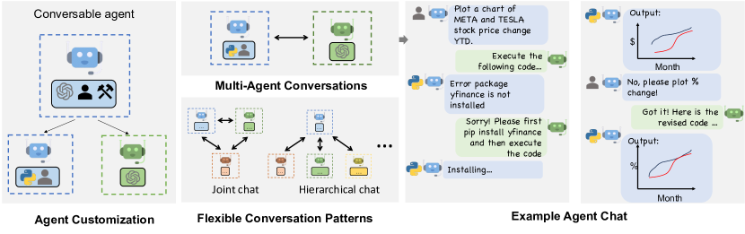
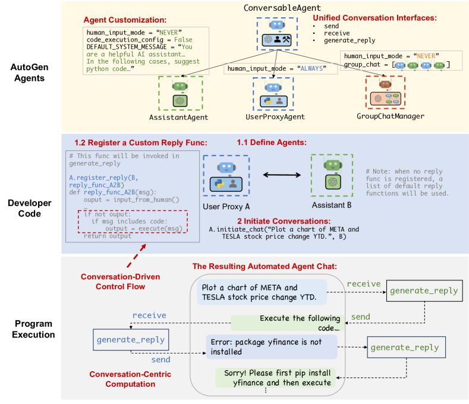

# AutoGen：通过多智能体对话实现下一代 LLM 应用（AutoGen: Enabling Next-Gen LLM Applications via Multi-Agent Conversation）

> Source: https://arxiv.org/abs/2308.08155
> Collected: 2026-05-19
> Published: 2023-08-16（arXiv v1；v2 2023-10-03）
> Full text: https://ar5iv.labs.arxiv.org/html/2308.08155

## 论文信息

- **作者**：Qingyun Wu、Gagan Bansal、Jieyu Zhang、Yiran Wu、Beibin Li、Erkang Zhu、Li Jiang、Xiaoyun Zhang、Shaokun Zhang、Jiale Liu、Ahmed Awadallah、Ryen W. White、Doug Burger、Chi Wang
- **机构**：Microsoft Research、宾夕法尼亚州立大学、华盛顿大学、西安交通大学等
- **arXiv 编号**：2308.08155
- **版本历史**：v1 2023-08-16；v2 2023-10-03
- **代码**：https://github.com/microsoft/autogen

## 摘要

AutoGen 是一个开源框架，让开发者通过**多个可相互对话的智能体**协作完成任务来构建 LLM 应用。AutoGen 的智能体**可定制、可对话**，可运行于"LLM + 人类输入 + 工具"的多种组合模式；开发者还能灵活定义智能体交互行为，用自然语言与代码共同编程灵活的对话模式。它是构建各种复杂度、各种 LLM 能力应用的通用框架。实证研究在数学、编码、问答、运筹、在线决策、娱乐等多领域示例应用中验证了其有效性。

## 分章节总结

### 1 引言

- 任务越来越复杂，直觉的扩展方式是用多个协作智能体（已有工作表明多智能体可促进发散思维、提升事实性与推理、提供验证）。
- 核心洞见：用**多智能体对话**实现。三点可行性：(1) 聊天优化 LLM 能吸收反馈，智能体可经对话协作；(2) 单个 LLM 能力广，不同配置智能体的对话可模块化互补地组合能力；(3) LLM 擅长把复杂任务拆成子任务，多智能体对话天然支持这种分解与整合。
- 需解决两个关键问题：(1) 如何设计有能力、可复用、可定制、在多智能体协作中有效的单个智能体；(2) 如何提供一个能容纳广泛对话模式的统一接口。
- 提出 AutoGen，基于两个新概念：**可定制可对话智能体** + **对话编程（conversation programming）**。

### 2 AutoGen 框架

#### 2.1 可对话智能体

- conversable agent：有特定角色、能收发消息、维护内部上下文、可配置一组能力（LLM/工具/人类输入）。
- 三类能力：1) **LLM**——角色扮演、隐式状态推断、据对话历史推进、给/吸收反馈、写代码；并提供结果缓存、错误处理、消息模板等增强推理层。2) **人类**——经 human-backed agent 在特定轮次征求人类输入；默认 UserProxyAgent 可配人类参与程度。3) **工具**——经代码执行或函数执行调用工具；默认 UserProxyAgent 能执行 LLM 建议的代码或函数调用。
- 定制与协作：`ConversableAgent` 为最高层抽象（默认可用 LLM/人类/工具）；`AssistantAgent`（LLM 支持的 AI 助手）与 `UserProxyAgent`（人类代理 / 执行代码与函数）是两个预配置子类。典型：assistant 生成方案 → user proxy 征求人类输入或执行代码 → 把结果作反馈回传。

#### 2.2 对话编程

- 两个概念：**computation**（智能体在多智能体对话中计算回复所采取的动作）与 **control flow**（这些计算发生的顺序/条件）。两者都以对话为中心、由对话驱动。
- 设计模式：
  1. **统一接口 + 自动回复机制**：所有智能体有统一 `send/receive` 与 `generate_reply`；收到消息即自动调用 `generate_reply` 回复，除非满足终止条件。内置基于 LLM 推理 / 代码或函数执行 / 人类输入的回复函数，也可注册自定义回复函数。无需额外的控制平面，对话流自然产生（去中心化、模块化）。
  2. **编程语言与自然语言融合控制**：① 自然语言控制（用 prompt 指挥 LLM 智能体，如默认系统消息让其修错重写、完成时回复 "TERMINATE"）；② 编程语言控制（Python 指定终止条件、人类输入模式、工具执行逻辑、最大自动回复数、注册程序化自动回复函数）；③ 两者间灵活切换。
- 支持静态预定义流，也支持动态对话流：自定义 `generate_reply`、函数调用、以及内置 `GroupChatManager` 的动态群聊（动态选下一发言者并广播）。

### 3 AutoGen 的应用（6 个）

- **A1 数学解题**：直接复用两个内置智能体即可在 MATH 数据集上超过 Multi-Agent Debate、LangChain ReAct、vanilla GPT-4、ChatGPT+Code Interpreter、ChatGPT+Wolfram 等（120 道 level-5 及全测集）；并支持 human-in-the-loop（设 `human_input_mode='ALWAYS'`）与多用户参与。
- **A2 检索增强代码生成与问答**：用内置智能体扩展出 Retrieval-augmented Chat（向量库 Chroma + SentenceTransformers）。引入**交互式检索**：检索不到时回复 "UPDATE CONTEXT" 触发更多检索而非终止。在 Natural Questions 上对比 DPR；消融表明交互式检索作用显著。
- **A3 文字世界决策**：ALFWorld 上两智能体系统（assistant 提计划 + executor 执行，集成 ReAct）。模块化地引入**grounding agent**在出现重复错误苗头时补充常识，平均带来 **15%** 性能提升（134 个未见任务，GPT-3.5-turbo）。
- **A4 多智能体编码**：基于 OptiGuide 构建 Commander/Writer/Safeguard 三智能体系统。核心工作流代码从 430+ 行减到 100 行；用户时间约省 3 倍、交互减少 3–5 倍；消融显示多智能体使识别不安全代码的 F1 提升 8%（GPT-4）/ 35%（GPT-3.5-turbo）。
- **A5 动态群聊**：`GroupChatManager` 重复"动态选发言者→收集回复→广播"。12 个复杂任务试点表明 role-play 式提示比纯任务提示成功率更高、LLM 调用更少。
- **A6 对话式国际象棋**：玩家智能体（人或 LLM）+ 第三方棋盘智能体（按规则验证走子）。消融去掉棋盘智能体只靠 prompt 接地，会因非法走子破坏游戏。

### 4 讨论

AutoGen 引入"可对话智能体 + 对话编程"，统一对话接口 + 自动回复机制。实验显示其带来性能提升、代码量与人工负担下降、灵活性（动态模式、人机协同）。任务分给独立智能体促进模块化（可分别开发/测试/维护）。尚处早期实验阶段，未来方向：整合已有智能体实现、自动化与人类控制的平衡、智能体拓扑与对话模式优化、以及多智能体带来的新安全挑战。

## 关键图表

### 图1：AutoGen 多智能体概念

（左）智能体可对话、可定制，可基于 LLM/工具/人类或其组合；（上中）智能体经对话解任务；（右）可组成群聊并含 human-in-the-loop；（下中）框架支持灵活对话模式。

### 图2：对话编程示意

上：AutoGen 内置智能体（统一对话接口、可定制）；中：用 AutoGen 开发带自定义回复函数的两智能体系统的开发者代码；下：程序执行时由此产生的自动智能体对话。

> 应用概览（图3）展示 6 个应用的不同对话模式；定量结果（图4 a–d，分别为 MATH/Q&A/ALFWorld/OptiGuide）显示 AutoGen 内置智能体开箱即用即达最有竞争力的表现、交互式检索增益、grounding agent 改善 ALFWorld、多智能体设计提升带安全防护的编码任务。完整子图与数值见 Full text 链接。

## 参考文献

完整参考文献见 Full text 链接。正文重点引用：Yao et al. 2022（ReAct）、Liang et al. 2023（Multi-Agent Debate）、Du et al. 2023（多智能体提升事实性/推理）、Hendrycks et al. 2021（MATH 数据集）、Lewis et al. 2020（RAG）、Kwiatkowski et al. 2019（Natural Questions）、Shridhar et al. 2021（ALFWorld）、Li et al. 2023a（OptiGuide）、Eleti et al. 2023（function calling）。
