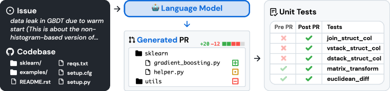

# SWE-bench：语言模型能解决真实世界的 GitHub Issue 吗？（SWE-bench: Can Language Models Resolve Real-World GitHub Issues?）

> Source: https://arxiv.org/abs/2310.06770
> Collected: 2026-05-19
> Published: 2023-10-10（arXiv v1；v3 2024-11-11）
> Full text: https://ar5iv.labs.arxiv.org/html/2310.06770

## 论文信息

- **作者**：Carlos E. Jimenez、John Yang、Alexander Wettig、Shunyu Yao、Kexin Pei、Ofir Press、Karthik Narasimhan
- **机构**：普林斯顿大学、芝加哥大学
- **arXiv 编号**：2310.06770
- **版本历史**：v1 2023-10-10；…；v3 2024-11-11
- **会议**：ICLR 2024
- **数据/榜单**：https://www.swebench.com

## 摘要

语言模型的能力已超出有效评估它们的能力。本文把真实世界软件工程作为评估下一代 LM 的丰富、可持续、有挑战的测试场，提出 **SWE-bench**：含来自 12 个流行 Python 仓库真实 GitHub issue 与对应 PR 的 **2294** 个软件工程问题。给定代码库与待解决 issue 描述，模型须编辑代码库以解决该 issue——常需跨多个函数、类乃至文件协调修改，与执行环境交互，处理极长上下文并做远超传统代码生成的复杂推理。评估显示 SOTA 专有模型与微调的 SWE-Llama 都只能解决最简单的问题：即便给定 oracle 检索器，Claude 2 和 GPT-4 也仅分别解决 **4.8%** 与 **1.7%**。

## 分章节总结

### 1 引言

- 现有基准（如 HumanEval）多为几行可解的自包含问题，已饱和、不反映前沿。真实软件工程不简单：修 bug 需在大仓库导航、理解跨文件函数交互、在杂乱代码里找小错。
- SWE-bench：模型解决提交到流行 GitHub 仓库的 issue（bug 报告或功能请求），生成补丁，再用仓库测试框架评估。优势：真实设定、12 仓库多样输入、基于执行的鲁棒评估、可持续更新（几乎无需人工）。
- 评估发现模型只解最简单 issue（Claude 2 4.8%、GPT-4 1.7%，oracle 检索；BM25 检索 Claude 2 降到 1.96%）。发布训练集 SWE-bench-train（37 个其他仓库 19000 个非测试实例），微调出 SWE-Llama 7b/13b（基于 CodeLlama），可用 >100000 token 上下文、与 Claude 2 竞争。

### 2 SWE-bench

#### 2.1 基准构建（3 阶段管线）

- **阶段 I 仓库选择与抓取**：从 12 个流行开源 Python 仓库收集约 ~90000 个 PR（流行仓库维护好、规范清晰、测试覆盖好）。
- **阶段 II 基于属性过滤**：选 (1) 解决某 GitHub issue 且 (2) 改动测试文件（表明贡献了验证测试）的已合并 PR。
- **阶段 III 基于执行过滤**：应用 PR 测试内容，记录其余内容应用前后测试结果，过滤掉没有至少一个"由失败变通过（fail-to-pass）"测试的实例，以及安装/运行出错的实例。
- 90000 PR → **2294** 个任务实例。

#### 2.2 任务表述

- **输入**：issue 文本描述 + 完整代码库；模型须做出编辑解决 issue，编辑表示为 patch 文件。
- **评估指标**：用 unix `patch` 应用生成补丁→执行该实例关联的单元/系统测试；补丁成功应用且全部测试通过即视为成功解决。指标为解决实例百分比。

#### 2.3 特性

真实软件工程任务；可持续更新（可评估训练截止后创建的 issue，避免泄漏）；多样长输入（issue 平均 195 词，代码库常数千文件）；鲁棒评估（每实例 ≥1 个 fail-to-pass 测试，40% 有 ≥2 个；中位再跑 51 个测试查旧功能）；跨上下文代码编辑（参考解平均改 1.7 文件 / 3.0 函数 / 32.8 行）；解空间宽（可比较检索/长上下文/决策智能体等多种路线，允许偏离参考 PR 的新解）。

### 3 SWE-Llama：为 SWE-bench 微调 CodeLlama

- 仅 CodeLlama 能处理所需超长上下文，但现成版本不会按详细指令做仓库级编辑（常输出占位或无关代码）。对 CodeLlama-Python 7B/13B 做监督微调，得到可在消费级硬件运行的"仓库编辑器"。
- 训练数据：再从 37 个流行 Python 仓库收集 19000 个 issue-PR 对（不要求 PR 含测试改动）。

### 4 实验设置

- **检索**：代码库（平均 438K 行）远超上下文窗口。两设定：① **稀疏检索** BM25（密集检索因键/查询过长且"自然语言查代码"不适用），试三种上下文上限取最佳；② **"Oracle" 检索**——只用参考补丁实际编辑的文件（不现实但也不一定充分）。BM25 在 27000 token 上限下约 40% 实例检出 oracle 文件的超集，但过半实例完全漏掉 oracle 文件。
- **输入格式**：任务说明 + issue 文本 + 检索文件与文档 + 示例补丁 + 生成补丁的提示。
- **模型**：ChatGPT-3.5（16k）、GPT-4（32k）、Claude 2（100k）、SWE-Llama（≥100k）。

### 5 结果

- **总体（表5）**：模型普遍极难解决 issue。最佳 Claude 2 在 oracle 检索仅 4.8%，BM25 降到 1.96%——凸显选对上下文的重要性。
- **难度按仓库**：各模型趋势相似但解出的实例不大重叠（oracle 下 Claude 2 解 110、SWE-Llama 13b 解 91，Claude 2 只解了 SWE-Llama 所解的 42%）。含图片的 issue（matplotlib 32%、seaborn 10% vs 全体 2%）可能需多模态/工具。
- **难度与上下文长度相关**：总上下文越长 Claude 2 性能显著下降（被无关上下文干扰、难定位待改代码）。Oracle-collapsed（折叠未改动代码 ±15 行）使 GPT-4 1.3%→3.4%、Claude 2 4.8%→5.9%。
- **难度与 issue 解决日期无关**：2023 前后差异小（GPT-4 例外），说明模型不大可能靠"生成更新版仓库"作弊。
- **微调模型对上下文分布偏移敏感**：SWE-Llama 用 oracle 上下文微调，在 BM25 设定下表现很差（被训练成编辑每个上下文文件，而 BM25 多数文件不该改）。
- **生成补丁比生成整文件容易**：模型很少见 patch 文件仍难生成格式正确的补丁；但让其重生成整文件更差（Claude 2 oracle 2.2% vs 4.8%）。
- **模型倾向更短更简单的编辑**：能正确应用的模型补丁不到 gold 补丁一半长度（30.1 vs 74.5 行），很少改多个文件。

### 7 讨论

局限与未来：目前全为 Python（拟扩展更多语言/领域）；实验只立最简单基线（鼓励 agent 式上下文定位、补丁生成微调、结合程序分析/软件工程工具）；仅靠基于执行的测试不足以保证生成质量（模型生成常不够全面/高效/可读）。结论：SWE-bench 借开源协作管线忠实镜像真实编码环境，推动更实用、智能、自主的 LM。

## 关键图表

### 图1：SWE-bench 任务

从真实 Python 仓库取任务：把 GitHub issue 与解决相关测试的已合并 PR 关联。给模型 issue 文本与代码库快照，模型生成补丁，用真实测试评估（Pre PR 失败、Post PR 通过的 fail-to-pass 测试）。

### 图2：三阶段构建管线

① Scrape PRs（12 个流行仓库、>90% Python）→ ② Attribute Filter（解决 issue + 贡献测试）→ ③ Execution Filter（安装成功 + PR 通过全部测试）。

### 表1：SWE-bench 任务实例属性（micro 平均）

| 类别 | 指标 | Mean | Max |
|---|---|---|---|
| Issue Text | 词数 | 195.1 | 4477 |
| Codebase | 非测试文件数 | 3,010 | 5,890 |
| | 非测试行数 | 438K | 886K |
| Gold Patch | 编辑行数 | 32.8 | 5888 |
| | 编辑文件数 | 1.7 | 31 |
| | 编辑函数数 | 3 | 36 |
| Tests | Fail-to-Pass 数 | 9.1 | 1633 |
| | 总测试数 | 120.8 | 9459 |

### 表5：BM25 与 Oracle 检索下各模型解决率（%）

| Model | BM25 %Resolved | BM25 %Apply | Oracle %Resolved | Oracle %Apply |
|---|---|---|---|---|
| ChatGPT-3.5 | 0.20 | 10.50 | 0.52 | 12.38 |
| Claude 2 | 1.96 | 29.86 | 4.80 | 47.00 |
| GPT-4* | 0.00 | 4.50 | 1.74 | 13.20 |
| SWE-Llama 7b | 0.70 | 37.84 | 3.00 | 54.80 |
| SWE-Llama 13b | 0.70 | 39.41 | 4.00 | 52.10 |

\* GPT-4 因预算仅在 25% 随机子集上评估（oracle 与 BM25 27K 设定）。

### 表4：BM25 检索不同上下文上限的解决率（%）

| Model | 13k | 27k | 50k |
|---|---|---|---|
| Claude 2 | 1.96 | 1.87 | 1.22 |
| SWE-Llama 7b | 0.70 | 0.31 | 0.00 |
| SWE-Llama 13b | 0.70 | 0.48 | 0.00 |

## 参考文献

完整参考文献见 Full text 链接。正文重点引用：Chen et al. 2021（HumanEval）、Rozière et al. 2023（CodeLlama）、Robertson et al. 2009（BM25）、Liu et al. 2023b（长上下文分心）、Srivastava et al. 2023（基准需求）、Cassano et al. 2022（MultiPL-E）。
