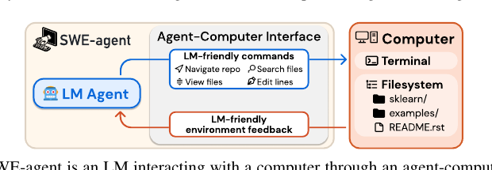

# SWE-agent：智能体-计算机接口使自动化软件工程成为可能（SWE-agent: Agent-Computer Interfaces Enable Automated Software Engineering）

> Source: https://arxiv.org/abs/2405.15793
> Collected: 2026-05-19
> Published: 2024-05-06（arXiv v1；v3 2024-11-11）
> Full text: https://arxiv.org/pdf/2405.15793 （PDF；该论文无 arXiv HTML / ar5iv 版本，按规范回退 PDF）

## 论文信息

- **作者**：John Yang、Carlos E. Jimenez、Alexander Wettig、Kilian Lieret、Shunyu Yao、Karthik Narasimhan、Ofir Press
- **机构**：Princeton Language and Intelligence, 普林斯顿大学
- **arXiv 编号**：2405.15793
- **版本历史**：v1 2024-05-06；…；v3 2024-11-11
- **会议**：NeurIPS 2024
- **数据/榜单**：swe-agent.com

## 摘要

LM 智能体越来越多用于自动化数字环境中的复杂任务。正如人类受益于 IDE 等强大软件，本文主张 LM 智能体是一类有自身需求与能力的新终端用户、也应受益于专为其打造的接口。研究接口设计如何影响 LM 智能体表现，提出 **SWE-agent**：让 LM 智能体自主使用计算机解决软件工程任务的系统。其定制的**智能体-计算机接口（Agent-Computer Interface, ACI）**显著增强智能体创建/编辑代码、浏览整个仓库、执行测试与程序的能力。在 SWE-bench 与 HumanEvalFix 上分别取得 **12.5%** 与 **87.7%** pass@1，远超此前非交互式 LM 的 SOTA。并给出 ACI 设计如何影响智能体行为与性能的洞见。

## 分章节总结

### 1 引言

- LM 智能体已在带执行反馈的代码生成上有效，但用于软件工程这类复杂任务尚未充分探索。人类做复杂编程靠 VSCode 等带强大工具的应用；受 HCI 关于用户界面研究启发，探究 LM 智能体是否也受益于更好设计的接口。
- 直接让智能体操作 Linux shell 时，LM 难以可靠行动（缺编辑小片段的简单命令、无效编辑无反馈），严重拖累性能——需要在 LM 与计算机间加一层抽象，即 **ACI**。
- SWE-agent = LM + ACI。相对 Linux shell 细粒度高度可配置的动作空间，ACI 提供少量用于查看/搜索/编辑的简单动作，用护栏防常见错误，每一步给出具体、简洁的命令效果反馈。**为 LM 量身定制的 ACI 优于为人类设计的 UI（如 Linux shell）**。
- 用 GPT-4 Turbo，SWE-agent 解决 12.47% 的 2294 个 SWE-bench 测试任务，大幅超此前非交互检索增强系统的最佳 3.8%；ACI 设计消融（SWE-bench Lite 300 实例）显示 SWE-agent 比仅用默认 Linux shell 的基线多解 10.7 个百分点；可移植到 Claude 3 Opus（解 10.5%）。
- 贡献：(1) 提出 ACI 概念，证明精心的 ACI 设计无需改 LM 权重即可大幅提升表现；(2) 构建并开源 SWE-agent，统一了工具使用/提示技术/代码执行三方面。

### 2 智能体-计算机接口（ACI）

- LM 作为智能体迭代采取动作、接收反馈。数字环境可被 API 与 UI 塑造，已有接口都为"人或程序"设计；LM 智能体是新一类终端用户，它们用来与计算机交互的接口称为 **ACI**（图2 类比 IDE 之于人）。
- 人与 LM 能力差异决定不同接口设计准则：当代 LM 缺乏直接操作 GUI 的视觉理解；语法检查/导航工具若以合适方式呈现对 LM 有用；人能灵活忽略无关信息，但对 LM 所有内容都有固定的内存与算力成本、分心上下文会损害表现。
- 良好 ACI 应：帮智能体理解应用状态、管理历史避免无用上下文、提供模型可高效可靠使用的动作。本文固定 LM、专注设计 ACI；用两法在开发集上优化：人工检查智能体行为找困难点提改进、网格搜索选最佳 ACI 配置。
- 四条 ACI 设计原则：
  1. **动作应简单、智能体易懂**：bash 命令常有数十选项；少选项 + 简洁文档的简单命令更易用，减少演示/微调需求。
  2. **动作应紧凑高效**：文件导航/编辑等重要操作应合并为尽量少的动作，单步即取得有意义进展。
  3. **环境反馈应有信息但简洁**：高质量反馈给出当前状态与近期动作效果的实质信息、无冗余（如编辑后告知修订内容）。
  4. **护栏缓解错误传播、加速恢复**：内置如代码语法检查器自动检测错误，帮智能体识别并快速纠正。

### 3 SWE-agent：为软件工程设计的 ACI

每步智能体生成一个 thought + 一个 command，把命令执行反馈纳入（ReAct 式）；构建于 Linux shell 之上，需要时可用常见 Linux 命令。

- **搜索与导航**：特殊命令 `find_file`、`search_file`、`search_dir`，输出搜索结果摘要而非冗长结果，每查询至多返回 50 条，超出则建议写更具体查询。
- **文件查看器**：`open` 打开文件，交互式查看器一次至多显示 100 行，`scroll_down/up`、`goto` 移动窗口；显示完整路径、总行数、上下省略行数、行号——便于在文件内导航与定位。
- **文件编辑器**：`edit` 与查看器联动，给定起始行/结束行/替换文本，单步替换整段；编辑后查看器自动显示更新内容，无需额外命令。集成代码 linter，编辑引入错误时报警并附前后片段，无效编辑被丢弃、要求重试。
- **上下文管理**：用信息性提示、错误消息、历史处理器保持上下文简洁。每步要求生成 thought + action，畸形生成触发错误响应要求重试，收到有效生成后除第一条外的历史错误消息被省略；倒数第 5 步之前的观察各折叠为单行，保留计划与动作历史同时减少无关上下文、避免展示过时文件信息。

### 4 实验设置

- **数据集**：主要 SWE-bench（2294 实例），主结果报全测试集、消融/分析报 SWE-bench Lite（300 个自包含功能 bug 修复子集）；另测 HumanEvalFix（短代码调试）。
- **模型**：GPT-4 Turbo（gpt-4-1106-preview，128k）与 Claude 3 Opus（200k）。试过 Llama 3、DeepSeek Coder 但其在智能体设定下表现不佳或上下文窗口太小（如 Llama 3 8k）。
- **基线**：① SWE-bench 中的非交互检索增强生成（RAG，BM25 检索 + 直接生成补丁）；② Shell-only（改编自 InterCode，LM 经 Linux shell 进程交互解 issue）。
- **指标**：% Resolved（pass@1）为主；另报 $ Avg. Cost（成功解决实例的平均 API 推理成本，每实例预算上限 $4，超则自动提交已有编辑）。
- **配置搜索**：在 SWE-bench 开发集少量手挑样本上定性分析得出最终 ACI；其余超参（窗口大小、历史处理、解码温度）做扫描。

### 5 结果

- 全系统中 SWE-agent w/ GPT-4 Turbo 最佳：全 SWE-bench 解 **12.47%（286/2294）**，Lite 解 **18.00%（54/300）**；相对 Lite 上 RAG 成本高 8–13×但 % Resolved 提升 6.7 倍；相对 Shell-only 提升 64%（均 GPT-4 Turbo）。
- HumanEvalFix：SWE-agent w/ GPT-4 Turbo 达 **88.3% pass@1**。平均性能方差不大但单实例可变。$B.2 显示成功率与 issue 日期无关（控制测试泄漏）。

#### 5.1 ACI 设计分析（表3 消融）

- **人类 UI 未必适合作 ACI**：LM 在 shell 搜索易陷阱（`cd/ls/cat` 链极低效，`grep/find` 偶产大量无关结果）。
- **紧凑高效的文件编辑至关重要**：无 SWE-agent 文件编辑器时性能降到 10.3%（↓7.7）；查看器行数太少（30 行 14.3% ↓3.7）或太多（整文件 12.7% ↓5.3）都更差。
- **护栏改善错误恢复**：常见失败是反复 edit 同一段（多因 edit 引入语法错）。给 edit 加"仅当不引入大错才应用修改"的干预，相对无 linting 显著提升（无 linting 15.0% ↓3.0）。
- **搜索接口**：Iterative 搜索（逐条 next/prev）会让智能体穷举每条匹配、耗尽预算，甚至比无搜索更差（无搜索 15.7% ↓2.3 vs Iterative 12.0% ↓6.0）；Summarized 搜索更优。

#### 5.2 智能体行为分析

- **复现/定位是第一步**：所有轨迹都以 `create`（写复现代码）或 `find_file/search_dir`（定位）开始；最常见动作三元组是 create→edit→python。
- **其余多为"edit 然后执行"循环**：第 5 步起最频繁两动作是 `edit` 与 `python`；后期穿插 `search_file/scroll/find_file` 等定位。提交多从第 10 步起，已解决任务更倾向更早提交。
- **编辑仍难**：2294 实例中 1185（51.7%）的 GPT-4 Turbo 轨迹有 ≥1 次失败编辑；累计失败越多恢复概率越低。任何编辑尝试最终成功概率 90.5%，但单次失败编辑后骤降到 57.2%。
- **快成功、慢失败**：成功实例中位成本 $1.21 / 12 步，失败 $2.52 / 21 步；93.0% 已解决实例在耗尽预算前提交（全体 69.0%）——加大预算/token 上限不大可能显著提升。
- **多数失败是实现不正确**：GPT-4o 自动分到 9 类，约 52.0% 未解决属"实现不正确/过度具体"，级联失败编辑占另 23.4%。

### 6 相关工作

软件工程基准（代码生成基准趋饱和，仓库级编辑引入真实 SE 推理挑战；SWE-bench 统一程序修复/缺陷定位/测试）；语言模型作智能体（Web 导航、计算机控制、代码生成；交互 + 代码生成日益结合）。据作者所知，SWE-agent 是首个探索"端到端软件工程语言智能体"的工作。

### 7 讨论

SWE-agent = LM + ACI，能自主解 SE 任务。证明为 LM 定制的 ACI 可发挥其长处、缓解其弱点；交互设计过程可视为系统的行为实验，有助于比较理解人类与人工智能。

## 关键图表

### 图1：SWE-agent 与 ACI

SWE-agent 是一个经 **Agent-Computer Interface（ACI）** 与计算机交互的 LM。ACI 包含智能体使用的 LM-friendly 命令（导航仓库、搜索文件、查看文件、编辑行）与来自计算机的 LM-friendly 环境反馈；计算机侧含 Terminal 与 Filesystem。

> 图2（PDF 第 2 页）以"IDE 之于人类工程师"类比"ACI 之于 LM 智能体"：左为 LM Agent ↔ Computer(ACI: File Viewer / File Editor / Code Search)，右为 Human ↔ Computer(UI: VSCode/PyCharm)。完整图见 Full text PDF。

### 表1：SWE-bench 全集与 Lite 主结果

| 设置 / 模型 | SWE-bench %Resolved | $ Avg.Cost | Lite %Resolved | Lite $ Avg.Cost |
|---|---|---|---|---|
| RAG w/ GPT-4 Turbo | 1.31 | 0.13 | 2.67 | 0.13 |
| RAG w/ Claude 3 Opus | 3.79 | 0.25 | 4.33 | 0.25 |
| Shell-only w/ GPT-4 Turbo | – | – | 11.00 | 1.46 |
| Shell-only w/o Demonstration | – | – | 7.33 | 0.79 |
| **SWE-agent w/ GPT-4 Turbo** | **12.47** | 1.59 | **18.00** | 1.67 |
| SWE-agent w/ Claude 3 Opus | 10.46 | 2.59 | 13.00 | 2.18 |

### 表2：HumanEvalFix pass@1（%）

| Model | Python | JS | Java |
|---|---|---|---|
| CodeLLaMa-instruct-13B | 29.2 | 19.5 | 32.3 |
| GPT-4 | 47.0 | 48.2 | 50.0 |
| DeepseekCoder-CodeAlpaca-6.7B | 49.4 | 51.8 | 45.1 |
| WaveCoder-DS-6.7B | 57.9 | 52.4 | 57.3 |
| SWE-agent w/ GPT-4 Turbo | 87.7 | 89.7 | 87.9 |

### 表3：SWE-bench Lite 上 ACI 消融（↓ 为相对 SWE-agent 的下降）

| 维度 | 设置 → %Resolved |
|---|---|
| Editor | edit action 15.0 ↓3.0；w/ linting 18.0；No edit 10.3 ↓7.7 |
| Search | Summarized 18.0；Iterative 12.0 ↓6.0；No search 15.7 ↓2.3 |
| File Viewer | 30 lines 14.3 ↓3.7；100 lines 18.0；Full file 12.7 ↓5.3 |
| Context | Last 5 Obs. 18.0；Full history 15.0 ↓3.0；w/o demo. 16.3 ↓1.7 |

### 图：SWE-agent w/ GPT-4 Turbo 在 SWE-bench Lite 的 Pass@k

6 次运行的 Pass@k 从 k=1 约 18% 升至 k=6 约 33%（图4）。失败模式分布（图8）：约 52% 为实现不正确/过度具体，级联失败编辑约 23.4%。

## 参考文献

完整参考文献见 Full text PDF。正文重点引用：Jimenez et al. 2024（SWE-bench [20]）、Yao et al.（ReAct [62]）、Yang et al.（InterCode [59]，Shell-only 基线来源）、Card et al.（HCI 用户界面研究 [7]）、Muennighoff et al.（HumanEvalFix [32]）、OpenAI（GPT-4 [34]）、Anthropic（Claude 3 [6]）、Rozière et al.（CodeLlama [14]）。
