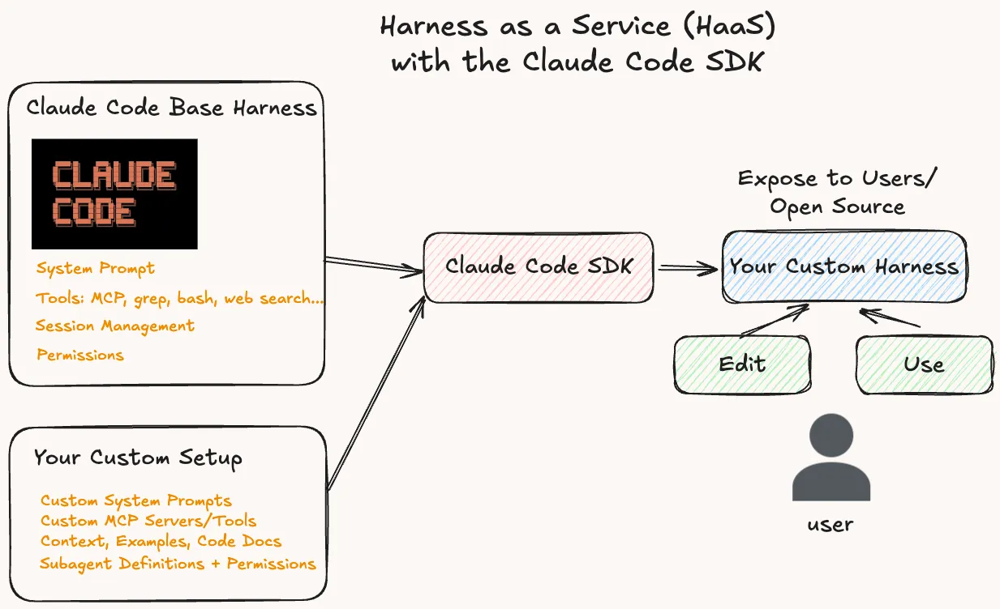

# Claude Code SDK 与 HaaS（Harness as a Service）的诞生（The Claude Code SDK and the Birth of HaaS (Harness as a Service)）

> Source: https://www.vtrivedy.com/posts/claude-code-sdk-haas-harness-as-a-service
> Collected: 2026-05-21
> Published: 2025-09-23
> Full text: https://www.vtrivedy.com/posts/claude-code-sdk-haas-harness-as-a-service

## 文章信息

- **作者**：Vivek Trivedy
- **载体**：个人博客（vtrivedy.com）
- **发布日期**：2025-09-23
- **性质**：工程实践 / 观点

---

随着任务对 agent 自主行为的要求越来越高，与 AI 协作的核心原语正在从 **LLM API（聊天式端点）** 转向 **Harness API（可定制运行时）**。我将其称为 **Harness as a Service (HaaS)**。通过丰富的 agent harness 生态系统，快速构建、定制和共享 agent。今天我们将讨论如何通过定制 harness 来快速构建可用的 agent，以及在开放 harness 世界中 agent 开发的未来。

```
client.chat.completions.create() --> client.responses.create() --> agent.query()
```

> **工作定义 — Agent Harness：** 增强模型运行时执行的外部功能集合。包括：(1) 对话与上下文管理，(2) 工具调用层（MCP/SDK 工具），(3) 权限控制，(4) 会话与文件系统状态，(5) 循环控制与错误处理，(6) 基础可观测性/遥测。

> **注意**：ChatGPT 网页端或 iOS 应用等 LLM 产品已经将模型包裹在自己的 harness 中，以实现安全、工具使用等功能。但如今使用 LLM API 需要你自行将模型封装在自己的 harness 中。这种情况正在改变——Claude Code 的 SDK 让其现有 harness 可以轻松扩展你自己的 prompt、工具、上下文和权限。用户获得了一个"开箱即用的可定制 agent 运行时"。

我们将涵盖 3 个核心观点：

1. 为什么 Claude Code 的 SDK 是目前构建和暴露可用 agent 的最佳"开箱即用"方案。
2. 作为构建者，你的工作是为你的任务**痴迷地定制** harness。（附示例）
3. 通过 harness 进行 agentic 开发的未来，以及开放 harness 生态的前景。

在未来的博客文章中，我们将深入探讨一个自定义项目的实现细节，以及 Claude Code SDK 在下文示例之外的高级功能。让我们开始。

## 开箱即用 = 速度 = 你的 Agent 真正存在

Agent 构建领域很嘈杂：agent、框架、工具、MCP、Codex、Claude Code、Cursor CLI……你懂的。但退后一步想。除非你是一家 agent 框架公司，否则你的目标是解决实际问题，而不是构建 agent 基础设施。一个（事后看来）显而易见但常常被忽视的事实：

> 好的 agent 构建是一个迭代的过程。如果你没有 v0.1，就无法迭代。开箱即用的设置让你的 agent 尽快到达内部团队手中。然后你可以在循环中不断编辑。

### 为什么关注这一点？Agent 构建是一场关于势能的练习

在 agent 构建中，工具/能力可能一夜之间就发生变化，这对测试之前无法奏效的杀手级功能来说是好事。但要在这里取得成功，你需要能够快速地进行内部（和外部）测试。Claude Code SDK 通过充当你的 agent 快速启动模板来降低 TTFF（首次反馈时间），就像 `create-react-app --> create-agent-app`。

框架释放了你的心智空间，让你专注于问题的复杂性。要快速前进，不要从零开始构建一切，将一些工作交给现有工具——它既能让你快速上手，又保留了未来强大的定制能力。这正是 Claude Code SDK 提供的那种能力卸载。我不会列出每个功能，他们的文档很扎实，这里有一个概览片段。

> Claude Code SDK 构建在驱动 Claude Code 的 agent harness 之上，提供了构建生产级 agent 所需的所有构建块。它利用了我们在 Claude Code 上的工作成果，包括：
> - **上下文管理（Context Management）**：自动压缩和上下文管理，确保你的 agent 不会耗尽上下文。
> - **丰富的工具生态（Rich tool ecosystem）**：文件操作、代码执行、网页搜索和 MCP 扩展性
> - **高级权限控制（Advanced permissions）**：对 agent 能力的细粒度控制
> - **生产级要素（Production essentials）**：内置错误处理、会话管理和监控
> - **优化的 Claude 集成（Optimized Claude integration）**：自动 prompt 缓存和性能优化

从文档中可以看到，Claude Code SDK 给你一套非常可用的基础 agent 原语集，这就是你的"harness"。这些内置功能为你节省数天到数周的工作，但更重要的是，你的团队现在可以专注于你自己的问题。

那么你的工作是什么？**用心定制。**

## Harness 定制——构建任何 Agent 的方法


_定制 harness 并通过 Claude Code SDK 使其可用的心智模型_

每个任务都需要特定的工具和指令集，你的工作就是定制这些输入：**System Prompt、Tools/MCP、Context、Subagents。** 一旦你有了东西，运行它并观察你的 agent 在做什么——这就是你的学习信号。持续改进你的输入，直到获得足够好的输出。以下是定制 harness 各部分的一些细节和技巧。

### 1. System Prompt

这是告诉 Claude Code 关于你问题的一切的起点——目标、运行环境、可用工具、需要遵循的指令和准则、格式规则、如何与用户交互等。

在这里花大量时间！Prompt 工程对于引导模型行为来说仍然活力十足。在 system prompt 上投入时间，是你在 agent 构建旅程中性价比最高的事情。

这里有一个模板可供开始，但 prompt 设计是一门艺术。你可以在这里看到一个效果很好的更长示例，这是我用 Claude Code 的 SDK 发布的一个项目——根据用户主题自主创建故事书（类似 Gemini 的 Storybook 功能）。

```
Goal/Persona: "You are "Story Director," an autonomous storybook creation agent that transforms ANY user input into complete illustrated storybooks..."
Environment/Tools Available: ...
Must Follow Instructions: ...
Examples + Tool Usage: ...
Final Checklist: ...
```

Claude Code 提供两种编辑 system prompt 的方式：`appendSystemPrompt` 和 `custom_system_prompt`，分别用于在 Claude 现有 system prompt 的基础上追加，或完全用你自己的内容重写。

### 2. Tools/MCPs

Claude Code 自带内置工具（网页搜索、grep、文件读写等），但你需要为特定用例定义自定义逻辑的工具（如：图片编辑 API、Slack 集成等）。你不必从零构建所有这些，可以使用 Smithery 等平台上打包好的现成 MCP 工具集。

关于工具设计，请深入思考三件事：

1. agent 需要做什么才能完成我为它设定的目标？有没有对应的工具？
2. 在 system prompt 和工具描述中，agent 是否清楚何时使用这些工具？
3. 能否通过将多个工具组合为更原子化的结果来减少出错面？例如：`generate_image` —> `generate_page_content`

Anthropic 关于 Writing Effective Tools for Agents 的博客和 Vercel 关于 MCP for LLMs not devs 的博客是工具/MCP 设计的两个优秀资源。

### 3. Context

关于 Context Engineering 有很多新内容。你给 agent 的上下文越好，它的表现就越好。以下是一些有用的上下文示例：

- **代码文档和代码片段：** 将这些保存为文件系统中的 markdown 文件。不要让 agent 去网上搜索你已经知道它会需要的东西。它可以按需引用这些代码片段。
- **记忆/用户个性化：** 你的 agent 是否应根据用户不同而有不同的行为？最简单的方式是将这些信息注入到一个 `user_info.md` 文件中，或者使用更精细的记忆服务。

经验法则：将所有关键上下文放在 system prompt 中，特别是第一个版本。将其他有用的上下文放在 markdown 文件中，并告诉你的 agent 何时以及如何使用其中的内容。

### 4. Subagents（可选）

对于 agent 的第一个版本，我强烈建议在单个 agent 线程中测试所有内容，以降低复杂度并快速将 agent 推向世界。Sub-agent 在两种场景下很有用：**特化（Specialization）** 和 **并行化（Parallelization）**。

Subagent 通过 `.claude/agents/{subagent_name}.md` 中的 YAML 定义。例如：

```
---
name: character-consistency-checker
description: Expert visual inspector.  Can tell if the character in the generated image matches the character reference image.
tools: Read, Grep, Glob, Bash
---
Your task is to make sure the character in the story matches the reference character.  You will read in 2 images, the character.png and the page.png file.  Then you will output True or False along with a reason for your decision

Make sure to check for the consistency of the size, color, art style, and other factors that would break the flow and overall vibe of the story
```

## HaaS——构建自定义 Agent 的未来

我们正在快速走向一个这样的世界：构建者创建自定义 harness，用户插入这些 harness 进一步编辑或作为产品使用。我们已经看到 bolt 等公司开启了这一趋势——他们帮助启动了 vibe coding 革命。他们在应用构建产品中直接使用 Codex 和 Claude Code，并且可能做了大量的 harness 定制才能让产品良好运行。对于公司来说，使用现有 harness 作为应用原语来构建产品体验，存在着巨大的机会。我预测在未来 6 个月内，大多数面向用户的 AI 产品都将使用现有的 agent harness 作为其核心用户交互模式。

对于深深痴迷于某个问题的构建者来说，所有这些都是好事。他们可以利用一个持续改进的可定制智能层，同时将时间专注于用户反馈、创建更好的 agent 输入，以及工程化更复杂、更可靠的体验。

Claude Code SDK 不会是唯一的玩家，它只是目前构建在其上最成熟的选择。OpenAI Codex、Gemini CLI、Cursor CLI、Amp 等已经在做出色的工作。但目标很明确——每个人都想成为用户插入获取智能的那个 harness。围绕出色 DX 和开箱即用的智能将产生大量机会。

### 开放 Harness 论点

如果你对这篇文章和 Prime Intellect 的 Environment Hub 等发布感到兴奋，你可能认同这样一个愿景：未来许多 harness 将是开源的，开发者可以在其上扩展。原始模型及其 harness 可能不是开源的，但构建产品体验所需的一切可能是开源的。这个未来更加令人兴奋，因为驱动前沿 harness 的基础模型有一天也完全可能成为开源的。**这就是 Agent 的开放 App Store。**

Harness 将"agent 基础设施"商品化，并将你的精力转移到能产生复利效应的地方：为你的领域调优的 prompt、工具和上下文。无论你称之为 HaaS 还是只是"构建 agent"，Claude Code SDK 都是当今最容易构建的 harness。从那个基线开始，激进地特化，并从 agent 的实际输出中持续改进。

如果这个未来让你兴奋，请联系我们，我们正在这里构建。下次再见，祝 harness 构建愉快。
