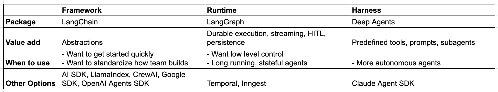

# Agent 框架、运行时与 Harness（Agent Frameworks, Runtimes, and Harnesses—oh my!）

> Source: https://www.langchain.com/blog/agent-frameworks-runtimes-and-harnesses-oh-my
> Collected: 2026-05-21
> Published: 2025-10-25
> Full text: https://www.langchain.com/blog/agent-frameworks-runtimes-and-harnesses-oh-my

## 文章信息

- **作者**：Harrison Chase（LangChain）
- **载体**：LangChain Blog
- **发布日期**：2025-10-25
- **性质**：概念辨析

---

我们维护着几个不同的开源包：LangChain 和 LangGraph 是其中最大的两个，而 DeepAgents 是一个日益受欢迎的新项目。我开始用不同的术语来描述它们：LangChain 是一个 agent framework，LangGraph 是一个 agent runtime，DeepAgents 是一个 agent harness。其他人也都在使用这些术语——但我认为目前还没有关于 framework、runtime 和 harness 的清晰定义。本文是我尝试为这些概念下定义的一次努力。我坦承这些概念之间仍然存在模糊性和重叠之处，因此非常欢迎反馈！

## Agent Frameworks（LangChain）

市面上大多数帮助开发者使用 LLM 构建应用的包，我都会归类为 agent framework。它们提供的主要价值是**抽象（abstractions）**。这些抽象代表了一种对世界的**心智模型**。理想情况下，这些抽象应该让入门变得更容易。它们还提供了一种标准的构建应用的方式，使开发者能够轻松上手并在不同项目之间切换。对抽象的批评在于：如果设计不当，它们可能会掩盖事物的内部运作机制，并且在高级用例中缺乏所需的灵活性。

我们将 LangChain 视为一个 agent framework。在 LangChain 1.0 的开发过程中，我们花了很多时间思考各种抽象——用于结构化内容块的抽象、用于 agent loop 的抽象、用于中间件（middleware）的抽象（我们认为中间件为标准 agent loop 增加了灵活性）。我认为属于 agent framework 的其他例子包括 Vercel 的 AI SDK、CrewAI、OpenAI Agents SDK、Google ADK、LlamaIndex，以及更多其他项目。

## Agent Runtimes（LangGraph）

当你需要在生产环境中运行 agent 时，你会需要某种 agent runtime。这个 runtime 应该提供更多**基础设施层面**的功能。首先想到的是 **durable execution**（持久化执行），但我也会把对 streaming 的支持、human-in-the-loop 支持、线程级持久化（thread-level persistence）和跨线程持久化（cross-thread persistence）等功能归入此类。

在构建 LangGraph 时，我们希望从零开始构建一个生产就绪的 agent runtime。你可以在这里阅读更多关于我们构建 LangGraph 的思考过程。我们认为与此最接近的其他项目是 Temporal、Inngest，以及其他 durable execution 引擎。

Agent runtime 通常比 agent framework **层级更低**，并且可以为 agent framework 提供底层支撑。例如，LangChain 1.0 就是构建在 LangGraph 之上的，以利用 LangGraph 提供的 agent runtime 能力。

## Agent Harnesses（DeepAgents）

DeepAgents 是我们正在开发的最新项目。它的层级比 agent framework **更高**——它构建在 LangChain 之上。它添加了默认的 prompt、对 tool call 的固执化处理（opinionated handling）、用于规划的工具（planning tools）、对文件系统的访问能力等等。它不仅仅是一个 framework——它是**自带全部配件**的（comes with batteries included）。

我们用来描述 DeepAgents 的另一种说法是"Claude Code 的通用版本"。公平地说，Claude Code 也在尝试成为一个 agent harness——他们发布的 Claude Agent SDK 就是朝这个方向迈出的一步。除了 Claude Agent SDK 之外，我认为目前没有太多其他通用 agent harness。不过也可以说，**所有**编码类 CLI 在某种意义上都是 agent harness，而且可能是通用的。

## 何时使用哪一个

让我们总结一下它们之间的差异，并讨论何时使用哪一个：

当然，我坦承这些界限是模糊的。例如，LangGraph 或许最好被描述为既是 runtime 又是 framework。"Agent Harness" 这个术语我刚开始看到被更多人使用（这个词不是我发明的）。我认为目前这三个概念都还没有一个超级清晰的定义。

在早期领域开发的乐趣之一，就是构建讨论事物的心智模型。我们知道 LangChain 与 LangGraph 不同，DeepAgents 与它们两个也不同。我们认为将它们分别描述为 framework、runtime 和 harness 是一种有助益的区分——但一如既往，我们非常欢迎你的反馈！
