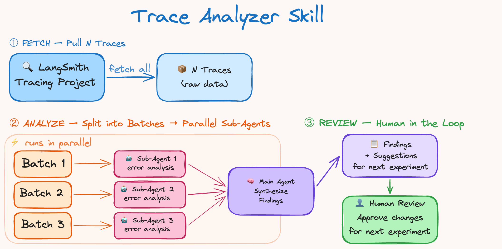

# 用 Harness 工程改进 Deep Agents（Improving Deep Agents with Harness Engineering）

> Source: https://www.langchain.com/blog/improving-deep-agents-with-harness-engineering
> Collected: 2026-05-21
> Published: 2026-02-17
> Full text: https://www.langchain.com/blog/improving-deep-agents-with-harness-engineering

## 文章信息

- **作者**：LangChain 团队
- **载体**：LangChain Blog
- **发布日期**：2026-02-17
- **性质**：工程实践 / 基准测试

---

## TL;DR

我们的编码 agent 在 Terminal Bench 2.0 上从 Top 30 提升到 Top 5。我们只改了 harness。以下是我们的 harness engineering 方法（剧透：self-verification 和 tracing 帮了大忙）。

## Harness Engineering 的目标

Harness 的目标是塑造模型固有的、参差不齐的智能，使其适配我们关心的任务。**Harness Engineering** 关注的是系统层面——你在模型周围构建工具，以优化任务性能、token 效率、延迟等目标。设计决策包括 system prompt、tool 选择和执行流程。

但你应该如何调整 harness 来改进 agent？

在 LangChain，我们使用 Trace 来大规模理解 agent 的失败模式。当今的模型在很大程度上是黑盒，其内部机制难以解释。但我们可以看到它们在文本空间中的输入和输出，然后将这些信息用于我们的改进循环中。

我们用一个简单的配方来迭代改进 deepagents-cli（我们的编码 agent），在 Terminal Bench 2.0 上提升了 `13.7` 分，从 `52.8` 提升到 `66.5`。我们只调整了 harness，保持模型固定为 `gpt-5.2-codex`。

## 实验设置 & Harness 上的旋钮

我们使用了 Terminal Bench 2.0，这是目前评估 agentic coding 的标准基准。它包含 89 个任务，涵盖机器学习、调试、生物学等领域。我们使用 Harbor 来编排运行——它会启动沙箱（Daytona），与我们的 agent 循环交互，并运行验证和评分。

每个 agent 操作都存储在 LangSmith 中，还包括延迟、token 数和成本等指标。

### **我们可以调节的旋钮**

一个 agent harness 有很多旋钮：system prompt、tools、hooks/middleware、skills、子 agent 委派、memory 系统等等。我们有意压缩了优化空间，专注于三个：**System Prompt、Tools** 和 **Middleware**（我们对 model 和 tool 调用周围的 hooks 的统称）。

我们从默认 prompt 和标准 tools+middleware 开始。使用 GPT-5.2-Codex 得分 52.8%。一个不错的分数，刚好在当前排行榜 Top 30 之外，但还有成长空间。

### **Trace Analyzer Skill**

我们希望 trace 分析可重复，因此将其做成了一个 Agent Skill。这充当了我们**分析跨运行的错误并改进 harness** 的配方。流程如下：

1. 从 LangSmith 获取实验 trace
2. 并行 spawn 错误分析 agent → 主 agent 综合发现 + 建议
3. 汇总反馈并对 harness 做出针对性修改

这与 boosting 的工作方式类似，专注于之前运行中的错误。人类在步骤 3 中可以相当有帮助（虽然不是必须的），用来验证和讨论建议的修改。对某个任务过拟合的修改不利于泛化，可能导致其他任务的回归。

自动化的 trace 分析节省了大量时间，使快速尝试实验变得容易。我们很快会发布这个 skill，目前正在测试它用于一般的 prompt 优化。

## 真正提升 Agent 性能的因素

自动化的 Trace 分析使我们能够调试 agent 在哪里出了问题。问题包括推理错误、不遵循任务指令、缺少测试和验证、时间耗尽等。我们在下面的章节中更详细地介绍这些改进。

### Build & Self-Verify

当今的模型是卓越的自我改进机器。

**Self-verification 允许 agent 通过运行内的反馈进行自我改进。** 然而，它们没有自然倾向进入这个 **build-verify 循环**。

最常见的失败模式是：agent 编写了解决方案，重新阅读自己的代码，确认看起来没问题，然后就停了。测试是自主 agentic coding 的关键部分。它有助于测试整体正确性，同时为 agent 提供信号来攀爬优化。

我们在 system prompt 中添加了关于如何解决问题的指导。

1. **Planning & Discovery（规划与发现）：** 阅读任务，扫描代码库，根据任务规格以及如何验证解决方案来制定初始计划。
2. **Build（构建）：** 考虑验证来实现计划。构建测试（如果不存在），并测试正常路径和边缘情况。
3. **Verify（验证）：** 运行测试，阅读完整输出，与任务要求（而非自己的代码）进行对比。
4. **Fix（修复）：** 分析任何错误，重新审视原始规格，修复问题。

我们非常关注测试，因为它驱动每次迭代中的变更。我们发现，除了 prompting 之外，确定性的 context 注入有助于 agent 验证其工作。我们使用一个 `PreCompletionChecklistMiddleware`，在 agent 退出之前拦截它，提醒它根据 Task spec 运行一次验证。这类似于 Ralph Wiggum Loop，即一个 hook 在退出时强制 agent 继续执行，我们将其用于验证。

### 为 Agent 提供环境上下文

Harness engineering 的一部分是**为 context engineering 构建良好的交付机制。** Terminal Bench 任务带有目录结构、内置工具和严格超时。

1. **目录上下文与工具：** 一个 `LocalContextMiddleware` 在 agent 启动时运行，映射 `cwd` 和其他父/子目录。我们运行 `bash` 命令来查找 `Python` 安装等工具。Context 发现和搜索容易出错，因此注入 context 减少了这个错误面，有助于**将 agent 引导到其环境中。**

2. **教会 Agent 编写可测试的代码：** Agent 不知道它们的代码需要如何可测试。我们添加了 prompting，说明它们的工作将根据程序化测试来衡量，类似于提交代码时。例如，提及文件路径的 Task spec 应当被精确遵循，以便解决方案在自动化评分步骤中能正常工作。强调边缘情况的 prompting 有助于 agent 避免只检查"正常路径"的情况。强制模型遵循测试标准是一种强大的策略，可以避免随时间推移的"slop buildup"。

3. **时间预算：** 我们注入时间预算警告，以推动 agent 完成工作并转向验证。Agent 在时间估算方面出了名的差，因此这种启发式方法在这个环境中很有帮助。现实世界的编码通常没有严格的时间限制，但如果不添加任何约束知识，agent 不会在时间边界内工作。

Agent 对其环境、约束和评估标准了解得越多，就越能自主地指导自己的工作。

**Harness 工程师的目的：准备并交付 context，使 agent 能够自主完成工作。**

### 鼓励 Agent 退后一步并重新审视计划

Agent 一旦决定了计划就可能目光短浅，导致陷入 "doom loop"——对同一个破损方法做微小变化（某些 trace 中超过 10 次以上）。

我们使用一个 `LoopDetectionMiddleware`，通过 tool 调用 hook 跟踪每个文件的编辑次数。在对同一文件进行 `N` 次编辑后，它会添加上下文，如"……考虑重新审视你的方法"。这可以帮助 agent 从 doom loop 中恢复，尽管如果模型认为它是正确的，它可以继续沿着同一条路径走下去。

重要提示。这是一种围绕当今感知到的模型问题进行工程设计的设计启发式方法。随着模型的改进，这些防护栏可能不再必要，但今天它有助于 agent 正确且自主地执行。

### 选择在推理上花费多少计算

推理模型可以自主运行数小时，因此我们必须决定在每个子任务上花费多少计算。你可以在每个任务上使用最大推理预算，但大多数工作可以从优化推理计算支出中受益。

Terminal Bench 的超时限制创造了权衡。更多推理有助于 agent 评估每一步，但可能消耗超过 `2x` 的 token/时间。`gpt-5.2-codex` 有 4 种推理模式：`low`、`medium`、`high` 和 `xhigh`。

我们发现推理有助于规划——充分理解问题。一些 Terminal Bench 任务非常困难。一个好的计划有助于更快地得到可用的解决方案。

后期阶段的验证也从更多推理中受益，以捕获错误并提交解决方案。作为启发式方法，我们选择 xhigh-high-xhigh "**reasoning sandwich**" 作为基线。

_在规划和验证上花费更多推理计算_

仅以 `xhigh` 运行时得分较低，为 `53.9%`，原因是 agent 超时，而以 `high` 运行时为 `63.6%`。在推理预算分配的试验运行中没有大的差异，因此我们坚持了我们的方法，将分数推到了 `66.5%`。

模型的自然方法是 **Adaptive Reasoning**，在 Claude 和 Gemini 模型中可以看到，模型自己决定在推理上花费多少计算。

在多模型 harness 中，平衡推理预算可能表现为：使用大模型进行规划，然后交给小模型进行实现。

## 构建 Agent Harness 的实用要点

Agent 的设计空间很大。以下是我们实验和构建 deepagents 过程中的一些通用原则。

1. **代表 Agent 进行 Context Engineering。** 对当今的 agent 来说，context 组装仍然很困难，尤其是在未见过的环境中。用目录结构、可用工具、编码最佳实践和问题解决策略等 context 引导模型，有助于减少糟糕搜索和规划中可避免错误的错误面。

2. **帮助 agent self-verify 其工作。** 模型偏向于它们的第一个合理解决方案。积极 prompt 它们通过运行测试和改进解决方案来验证工作。这在没有人类在环的自主编码系统中尤其重要。

3. **将 Tracing 作为反馈信号。** Trace 允许 agent 自我评估和自我调试。重要的是将工具和推理一起调试（例如：模型走错路径是因为它们缺少工具或关于如何做某事的指令）。

4. **短期检测和修复不良模式。** 当今的模型并不完美。Harness 设计师的工作是围绕当今的缺陷进行设计，同时为未来更智能的模型做准备。盲目重试和不验证工作是很好的例子。这些防护栏几乎肯定会在未来消失，但要在今天构建健壮的 agent 应用程序，它们是有用的实验工具。

5. **为模型定制 Harness。** Codex 和 Claude 的 prompting 指南表明，模型需要不同的 prompting。使用早期 harness 版本的 Claude Opus 4.6 测试运行得分 `59.6%`，有竞争力但比 Codex 差，因为我们没有对 Claude 运行同样的改进循环。许多原则可以泛化，比如良好的 context 准备和对验证的关注，但针对你的任务运行几轮 harness 迭代有助于最大化 agent 在各任务上的性能。

Harness 设计方面还有更多的开放研究要做。有趣的方向包括多模型系统（Codex、Gemini 和 Claude 协同工作）、用于持续学习的 memory 原语（使 agent 能在任务上自主改进），以及跨模型衡量 harness 变更。

对于改进 agent 的外循环，我们正在研究 RLM 等方法来更高效地挖掘 trace。我们将继续改进 harness 并公开分享我们的研究。

我们创建了一个 Trace 数据集与社区分享。

Deep Agents 是开源的。支持 Python 和 JavaScript。

**致更多的 hill climbing 和开放研究。**
