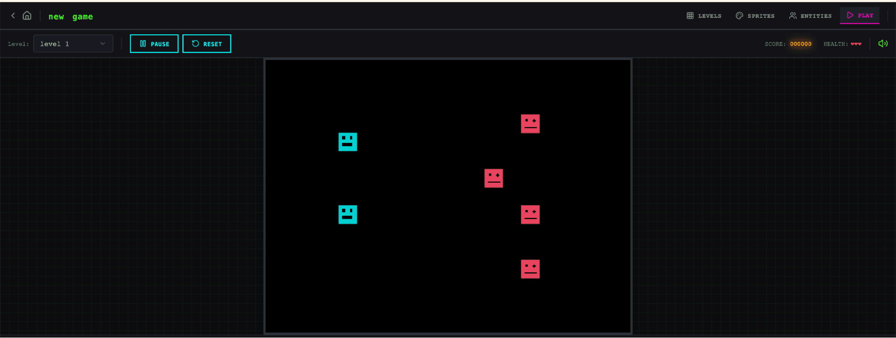

# 长时间运行应用开发的 Harness 设计（Harness Design for Long-Running Application Development）

> Source: https://www.anthropic.com/engineering/harness-design-long-running-apps
> Collected: 2026-05-21
> Published: Unknown
> Full text: https://www.anthropic.com/engineering/harness-design-long-running-apps

## 文章信息

- **作者**：Prithvi Rajasekaran（Anthropic Labs）
- **载体**：Anthropic Engineering Blog
- **发布日期**：Unknown
- **性质**：工程实践 / 研究

---

*作者：Prithvi Rajasekaran，Labs 团队成员。*

过去几个月，我一直在解决两个相互关联的问题：让 Claude 产出高质量的前端设计，以及让它在无需人类干预的情况下构建完整应用。这项工作源于我们早期在前端设计技能和长时运行编码 agent harness 方面的探索——我和同事们当时通过 prompt 工程和 harness 设计将 Claude 的表现提升到了远超基线的水平，但两者最终都撞到了天花板。

为了突破这些天花板，我寻求了能够在两个截然不同的领域都适用的 AI 工程新方法——一个由主观审美定义，另一个由可验证的正确性和可用性定义。从生成对抗网络（GAN）中汲取灵感，我设计了一个包含 **generator**（生成器）和 **evaluator**（评估器）agent 的多 agent 架构。要构建一个能可靠地对输出进行评分——并且有品味的——evaluator，首先需要开发一套标准，将"这个设计好不好？"这样的主观判断转化为具体的、可评分的维度。

随后，我将这些技术应用于长时间运行的自主编码任务，从早期 harness 工作中延续了两条经验：将构建过程分解为可管理的分块，以及使用结构化 artifacts 在会话之间传递 context。最终成果是一个三 agent 架构——planner（规划器）、generator（生成器）和 evaluator（评估器）——能够在长达数小时的自主编码会话中构建出丰富的全栈应用。

## 为什么朴素实现行不通

我们之前已经展示过，harness 设计对长时间运行的 agentic 编码效果有重大影响。在早期的实验中，我们使用一个 initializer agent 将产品 spec 分解为任务清单，再由一个 coding agent 逐 feature 实现任务，然后通过 artifacts 交接在会话间传递 context。更广泛的开发者社区也收敛到了类似的洞察，例如"Ralph Wiggum"方法使用 hooks 或 scripts 让 agent 保持持续的迭代循环。

但一些问题仍然持续存在。对于更复杂的任务，agent 随着时间推移仍然容易跑偏。在分解这个问题时，我们观察到 agent 在执行此类任务时有两个常见的失败模式。

第一个问题是，随着 context window 被填满，模型在冗长任务上容易失去连贯性（参见我们关于 context engineering 的文章）。有些模型还会表现出"context anxiety"（上下文焦虑）——当它们接近自认为的 context 限制时，会过早地收尾工作。Context reset——完全清空 context window 并启动一个新 agent，结合结构化 handoff 来传递前一个 agent 的状态和下一步——可以同时解决这两个问题。

这不同于 compaction（压缩），compaction 是将对话中较早的部分就地摘要化，让同一个 agent 可以在缩短的历史记录上继续工作。虽然 compaction 保持了连续性，但它并没有给 agent 一个干净的状态重置，这意味着 context anxiety 仍然可能持续存在。reset 提供了一个干净的状态重置，代价是 handoff artifact 必须包含足够的状态信息让下一个 agent 能无缝接手工作。在我们早期的测试中，我们发现 Claude Sonnet 4.5 表现出的 context anxiety 足够强烈，以至于仅靠 compaction 无法实现良好的长任务性能，因此 context reset 成为 harness 设计中不可或缺的组成部分。这解决了核心问题，但也给每次 harness 运行增加了编排复杂度、token 开销和延迟。

第二个问题是我们之前没有解决过的：自我评估（self-evaluation）。当被要求评估自己产出的工作时，agent 往往会自信地赞美作品——即使对人类观察者来说，质量明显只是平庸水平。这个问题在主观任务（如设计）中尤为突出，因为不存在与可验证软件测试等效的二元检查。一个布局是精致还是模板化，这是一个判断题，而 agent 在给自己打分时稳定地偏向积极。

然而，即使对于有可验证结果的任务，agent 有时仍然表现出糟糕的判断力，阻碍了它们在完成任务过程中的表现。将执行工作的 agent 和评判工作的 agent 分离开来，被证明是解决这个问题的有力杠杆。这种分离并不会立即消除那种宽容倾向；evaluator 仍然是倾向于对 LLM 生成输出慷慨的 LLM。但是，调优一个独立的 evaluator 使其保持怀疑态度，远比让 generator 对自己的作品挑剔来得可行。一旦外部反馈存在，generator 就有了具体的迭代目标。

## 前端设计：让主观质量可评分

我从前端设计开始实验，因为 self-evaluation 问题在这里最为明显。在没有任何干预的情况下，Claude 通常会倾向于安全、可预测的布局——技术上功能正常，但视觉上平平无奇。

两个洞察塑造了我为前端设计构建的 harness。第一，虽然美学不能完全简化为一个分数——而且个人品味永远存在差异——但通过编码设计原则和偏好的评分标准可以加以改善。"这个设计漂亮吗？"很难一致地回答，但"这是否遵循了我们的好设计原则？"给了 Claude 具体的评分维度。第二，通过将前端生成与前端评分分离，我们可以创建一个反馈循环，推动 generator 朝着更强的输出前进。

基于此，我编写了四个评分标准，并在 prompt 中同时提供给 generator 和 evaluator agent：

- **Design quality（设计质量）：** 设计是否感觉像一个统一的整体，而非一堆部件的拼凑？这方面的出色表现意味着颜色、排版、布局、图像和其他细节共同创造出独特的氛围和识别度。
- **Originality（原创性）：** 是否有自定义决策的痕迹，还是模板布局、库默认值和 AI 生成模式？人类设计师应该能识别出有意的创意选择。未修改的 stock 组件——或 AI 生成的典型特征，如白色卡片上的紫色渐变——在此项上不合格。
- **Craft（工艺）：** 技术执行：排版层次、间距一致性、色彩和谐、对比度。这是能力检查而非创意检查。大多数合理的实现默认就能做好；失败意味着基础出了问题。
- **Functionality（功能性）：** 独立于美学的可用性。用户能否理解界面的功能、找到主要操作，并在无需猜测的情况下完成任务？

我强调了 design quality 和 originality 的权重大于 craft 和 functionality。Claude 默认在 craft 和 functionality 上就已经得分不错，因为所需的技术能力对模型来说往往是自然而然的。但在设计和原创性方面，Claude 产出的输出充其量只能算是平淡。这些标准明确惩罚了高度泛化的"AI slop"模式，通过更重地加权设计和原创性，推动模型朝着更多审美冒险的方向前进。

我使用带有详细分数分解的 few-shot 示例来校准 evaluator。这确保了 evaluator 的判断与我的偏好一致，并减少了跨迭代的分数漂移。

我在 Claude Agent SDK 上构建了这个循环，这让编排变得简单直接。Generator agent 首先根据用户 prompt 创建一个 HTML/CSS/JS 前端。我给 evaluator 提供了 Playwright MCP，让它能在评分每个标准之前直接与实时页面交互，然后撰写详细的评审意见。在实践中，evaluator 会自己导航页面，截图并仔细研究实现后再产出评估结果。这些反馈流回 generator，作为下一次迭代的输入。每次生成我运行 5 到 15 次迭代，每次迭代通常会将 generator 推向更独特的方向，因为它在回应 evaluator 的批评。由于 evaluator 是主动导航页面而非对静态截图评分，每个周期需要实际的墙上时钟时间。完整运行最长可达四小时。我还指示 generator 在每次评估后做出战略决策：如果分数趋势良好则优化当前方向，如果方法行不通则完全转向不同的美学风格。

跨多次运行，evaluator 的评估分数随迭代次数提升然后趋于平稳，且仍有提升空间。有些生成是渐进式优化。另一些则在迭代间发生了剧烈的美学转向。

评分标准的措辞以我未完全预料到的方式引导了 generator。加入诸如"最好的设计具有博物馆品质"这样的短语，将设计推向了特定的视觉收敛，表明与标准相关的 prompt 直接塑造了输出的特征。

虽然分数通常随迭代提升，但模式并非总是干净的线性。后期的实现在整体上往往更好，但我经常看到我更喜欢中间迭代而非最后一个的情况。实现复杂度也倾向于在轮次间增加，generator 在回应 evaluator 反馈时会尝试更雄心勃勃的解决方案。即使在第一次迭代时，输出也明显优于完全没有 prompt 的基线，表明标准和相关语言本身就在 evaluator 反馈导致进一步优化之前，将模型从泛化默认值中引导了出来。

在一个值得注意的案例中，我 prompt 模型为一个荷兰美术馆创建网站。到第九次迭代时，它产出了一个虚构美术馆的干净、暗色主题着陆页。该页面视觉上精致，但基本符合我的预期。然后，在第十个周期，它完全抛弃了原有方法，将网站重新构想为一种空间体验：一个用 CSS perspective 渲染的棋盘格地板的 3D 房间，画作以自由形式的位置挂在墙上，通过门口在展厅间导航，而非滚动或点击。这是我在单次生成中从未见过的创造性飞跃。


## 扩展到全栈编码

带着这些发现，我将这个 GAN 启发的模式应用到全栈开发中。Generator-evaluator 循环自然地映射到软件开发生命周期，其中 code review 和 QA 扮演着与设计 evaluator 相同的结构角色。

### 架构

在我们早期的长时运行 harness 中，我们通过 initializer agent、逐 feature 工作的 coding agent 和会话间的 context reset 解决了连贯的多会话编码问题。Context reset 是一个关键突破：harness 使用 Sonnet 4.5，而 Sonnet 4.5 表现出了前面提到的"context anxiety"倾向。创建一个能在 context reset 之间良好工作的 harness 对于保持模型在任务上是关键。Opus 4.5 在很大程度上自行消除了这种行为，因此我能够在此次 harness 中完全放弃 context reset。Agent 在整个构建过程中作为一个连续会话运行，Claude Agent SDK 的自动 compaction 处理 context 增长。

在这项工作中，我在原始 harness 的基础上构建了一个三 agent 系统，每个 agent 解决我在先前运行中观察到的一个特定差距。系统包含以下 agent 角色：

**Planner（规划器）：** 我们之前的长时运行 harness 要求用户预先提供详细的 spec。我希望自动化这一步，因此创建了一个 planner agent，它接收一个简单的 1-4 句 prompt，并将其扩展为完整的产品 spec。我 prompt 它在范围上保持雄心，专注于产品 context 和高层技术设计，而非详细的技术实现。这种强调是因为担心如果 planner 试图预先指定粒度级的技术细节且出了差错，spec 中的错误会级联到下游实现。让 agent 专注于要交付的成果，让它们在工作过程中自己找到路径，似乎更明智。我还要求 planner 寻找将 AI 功能编织到产品 spec 中的机会。（参见底部附录中的示例。）

**Generator（生成器）：** 早期 harness 中的一次一个 feature 的方法在范围管理方面效果良好。我在这里应用了类似的模型，指示 generator 以 sprint 方式工作，一次从 spec 中取一个 feature。每个 sprint 使用 React、Vite、FastAPI 和 SQLite（后来是 PostgreSQL）技术栈实现应用，generator 被指示在每个 sprint 结束时自行评估工作，然后交接给 QA。它还使用 git 进行版本控制。

**Evaluator（评估器）：** 早期 harness 产出的应用通常看起来令人印象深刻，但当你真正尝试使用时仍然有真实的 bug。为了捕获这些问题，evaluator 使用 Playwright MCP 像用户一样点击浏览运行中的应用，测试 UI 功能、API endpoint 和数据库状态。然后根据发现的 bug 以及从前端实验借鉴的标准集对每个 sprint 进行评分——此处调整为覆盖产品深度、功能性、视觉设计和代码质量。每个标准都有硬性阈值，如果任何一个低于阈值，sprint 就会失败，generator 会收到关于出了什么问题的详细反馈。


在每个 sprint 之前，generator 和 evaluator 协商一个 sprint contract：在任何代码编写之前就这一块工作的"完成"标准达成一致。这之所以存在，是因为产品 spec 是有意保持高层的，我想要一个步骤来弥合用户故事和可测试实现之间的差距。Generator 提出它将构建什么以及如何验证成功，evaluator 审查该提案以确保 generator 在构建正确的东西。两者反复迭代直到达成一致。

通信通过文件处理：一个 agent 写入文件，另一个 agent 读取并在该文件内或用一个新文件回复，前一个 agent 再去读取。Generator 然后根据协商一致的 contract 构建，再将工作交接给 QA。这让工作忠实于 spec，而不会过早过度指定实现。

### 运行 Harness

对于这个 harness 的第一个版本，我使用 Claude Opus 4.5，将用户 prompt 同时在完整 harness 和单 agent 系统上运行以进行比较。我使用 Opus 4.5，因为这是我开始这些实验时我们最好的编码模型。

我写了以下 prompt 来生成一个复古游戏制作器：

> *创建一个 2D 复古游戏制作器，功能包括关卡编辑器、精灵编辑器、实体行为和可玩的测试模式。*

下表显示了 harness 类型、运行时长和总成本。

| **Harness** | **时长** | **成本** |
| --- | --- | --- |
| Solo（单 agent） | 20 分钟 | $9 |
| Full harness（完整 harness） | 6 小时 | $200 |

Harness 超过 20 倍昂贵，但输出质量的差异立竿见影。

我期待一个可以构建关卡及其组成部分（精灵、实体、瓦片布局），然后点击播放来实际玩关卡的界面。我先打开了 solo 运行的输出，初始应用似乎符合这些预期。

然而，当我点击浏览时，问题开始浮现。布局浪费空间，固定高度的面板让大部分视口为空。工作流很死板。尝试填充关卡时，系统提示我先创建精灵和实体，但 UI 中没有任何东西引导我走向那个顺序。更重要的是，实际的游戏是坏的。我的实体出现在屏幕上，但没有任何东西响应输入。深入代码发现，实体定义和游戏运行时之间的连接是断裂的，表面上没有任何指示出断在哪里。

评估完 solo 运行后，我把注意力转向 harness 运行。这次运行从相同的一句话 prompt 开始，但 planner 步骤将那个 prompt 扩展为一个跨 10 个 sprint 的 16 feature spec。它远超 solo 运行尝试的范围。除了核心编辑器和播放模式外，spec 还要求精灵动画系统、行为模板、音效和音乐、AI 辅助精灵生成器和关卡设计器，以及游戏导出和可分享链接。我给了 planner 我们前端设计技能的访问权限，它读取并将其作为 spec 的一部分用于创建应用的视觉设计语言。对于每个 sprint，generator 和 evaluator 协商一个 contract，定义该 sprint 的具体实现细节和用于验证完成性的可测试行为。

应用立即显示出比 solo 运行更多的精致感和流畅度。Canvas 使用了全部视口，面板大小合理，界面有一致的视觉识别度，跟踪着 spec 中的设计方向。我在 solo 运行中看到的一些笨拙仍然存在——工作流仍然没有清楚地说明你应该在尝试填充关卡之前先构建精灵和实体，我不得不通过摸索来发现这一点。这读起来更像是基础模型在产品直觉上的差距，而非 harness 设计要解决的问题，尽管它确实暗示了一个在 harness 内部进行定向迭代可以进一步改善输出质量的位置。

通过编辑器工作时，新运行相比 solo 的优势更加明显。精灵编辑器更丰富、功能更完善，工具面板更干净，取色器更好，缩放控件更易用。

因为我要求 planner 将 AI 功能编织到其 spec 中，应用还内置了 Claude 集成，让我可以通过 prompting 生成游戏的不同部分。这显著加速了工作流。

最大的差异在播放模式。我实际上能够移动我的实体并玩游戏。物理有一些粗糙之处——我的角色跳到平台上但最终与它重叠，直觉上感觉不对——但核心功能工作了，而 solo 运行没有做到这一点。在四处移动了一会儿之后，我确实遇到了 AI 游戏关卡构建的一些限制。有一面大墙我跳不过去，所以被卡住了。这表明还有一些常识性改进和边缘情况可以让 harness 进一步优化应用。

阅读日志时，很明显 evaluator 让实现保持在 spec 的轨道上。每个 sprint，它走过 sprint contract 的测试标准，通过 Playwright 操作运行中的应用，对任何偏离预期行为的问题提交 bug。Contract 非常细粒度——仅 Sprint 3 就有 27 个标准覆盖关卡编辑器——evaluator 的发现足够具体，可以直接采取行动而无需额外调查。下表展示了我们的 evaluator 识别出的几个问题示例：


| **Contract 标准** | **Evaluator 发现** |
| --- | --- |
| 矩形填充工具允许点击拖拽以选定瓦片填充矩形区域 | **FAIL** —— 工具只在拖拽起始/结束点放置瓦片，而非填充区域。`fillRectangle` 函数存在但未在 mouseUp 时正确触发。 |
| 用户可以选择并删除已放置的实体生成点 | **FAIL** —— `LevelEditor.tsx:892` 处的 Delete 键处理程序同时需要 `selection` 和 `selectedEntityId` 被设置，但点击实体只设置了 `selectedEntityId`。条件应为 `selection \|\| (selectedEntityId && activeLayer === 'entity')`。 |
| 用户可以通过 API 重新排序动画帧 | **FAIL** —— `PUT /frames/reorder` 路由定义在 `/{frame_id}` 路由之后。FastAPI 将 'reorder' 匹配为 frame_id 整数并返回 422："unable to parse string as an integer。" |

让 evaluator 达到这个水平需要付出努力。开箱即用的情况下，Claude 是一个糟糕的 QA agent。在早期运行中，我观察到它识别出合理的问题，然后说服自己这些问题不是大事，最终还是批准了工作。它还倾向于浅层测试，而非探测边缘情况，因此更微妙的 bug 经常漏网。调优循环是：阅读 evaluator 的日志，找到它的判断与我的判断不同的案例，更新 QA prompt 来解决这些问题。经过好几轮这样的开发循环，evaluator 才以一种我认为合理的方式评分。即便如此，harness 输出仍显示出模型 QA 能力的局限：小型布局问题、某些地方感觉不直观的交互，以及 evaluator 未充分测试的更深嵌套功能中未发现的 bug。显然还有更多验证空间可以通过进一步调优来捕获。但与 solo 运行（应用的核心功能根本不工作）相比，提升是显而易见的。

### 迭代 Harness

第一组 harness 结果令人鼓舞，但也笨重、缓慢且昂贵。合乎逻辑的下一步是在不降低性能的情况下简化 harness。这部分是常识，部分是一个更普遍原则的体现：harness 中的每个组件都编码了一个关于模型自身无法做什么的假设，这些假设值得做压力测试，既因为它们可能不正确，也因为随着模型改进它们可能很快过时。我们的博文 [Building Effective Agents](https://www.anthropic.com/engineering/building-effective-agents) 将底层思想表述为"找到最简单的可行方案，只在需要时才增加复杂度"，这是任何维护 agent harness 的人都会持续遇到的模式。

在我第一次简化的尝试中，我大幅裁剪了 harness 并尝试了一些有创意的新想法，但无法复现原始版本的性能。也变得难以判断 harness 设计的哪些部分实际上是承重的，以及以何种方式承重。基于那次经验，我转向了更系统的方法：一次移除一个组件并审查对最终结果的影响。

在我进行这些迭代周期时，我们还发布了 Opus 4.6，这为进一步减少 harness 复杂度提供了动力。有充分的理由预期 4.6 比 4.5 需要更少的脚手架。我们的发布博文写道："[Opus 4.6] 规划更仔细，能更持久地维持 agentic 任务，在更大的代码库中运行更可靠，拥有更好的代码审查和调试技能来捕获自己的错误。" 它在长 context 检索方面也有大幅改进。这些都是 harness 一直在补充的能力。

### 移除 Sprint 结构

我首先完全移除了 sprint 结构。Sprint 结构帮助将工作分解为模型可以连贯处理的分块。鉴于 Opus 4.6 的改进，有充分理由相信模型可以原生处理这项工作，无需这种分解。

我保留了 planner 和 evaluator，因为每个都继续增加明显的价值。没有 planner，generator 会低估范围：面对原始 prompt，它会不经事先 spec 就开始构建，最终创建出一个功能不如 planner 丰富的应用。

移除 sprint 结构后，我将 evaluator 改为在运行结束时单次执行，而非按 sprint 评分。由于模型能力大幅提升，evaluator 在某些运行中的承重程度发生了变化，其有用性取决于任务相对于模型自身能可靠完成的范围。在 4.5 上，那个边界很近：我们的构建处于 generator 单独能做好的边缘，evaluator 在整个构建过程中捕获了有意义的问题。在 4.6 上，模型的原始能力增加了，所以边界向外移动了。过去需要 evaluator 检查才能连贯实现的任务现在通常在 generator 自己能处理好的范围内，对于该边界内的任务，evaluator 变成了不必要的开销。但对于构建中仍处于 generator 能力边缘的部分，evaluator 仍然提供了真正的提升。

实际意义是，evaluator 不是一个固定的有或没有的决策。当任务超出了当前模型自身可靠完成的范围时，它值得付出成本。

在结构简化的同时，我还增加了 prompt 来改善 harness 如何将 AI 功能构建到每个应用中，特别是让 generator 构建一个能通过 tool 驱动应用自身功能的 agent。这需要真正的迭代，因为相关知识足够新，Claude 的训练数据覆盖很薄。但经过足够的调优，generator 能正确构建 agent 了。

### 更新 Harness 的结果

为了测试更新后的 harness，我使用以下 prompt 生成一个数字音频工作站（DAW）——一个用于作曲、录制和混音的音乐制作程序：

> *在浏览器中使用 Web Audio API 构建一个功能完整的 DAW。*

运行仍然耗时且昂贵，大约 4 小时，token 成本 $124。

大部分时间花在 builder 上，它在没有 Opus 4.5 所需的 sprint 分解的情况下连贯运行了超过两个小时。

| **Agent & 阶段** | **时长** | **成本** |
| --- | --- | --- |
| Planner | 4.7 分钟 | $0.46 |
| Build（第 1 轮） | 2 小时 7 分钟 | $71.08 |
| QA（第 1 轮） | 8.8 分钟 | $3.24 |
| Build（第 2 轮） | 1 小时 2 分钟 | $36.89 |
| QA（第 2 轮） | 6.8 分钟 | $3.09 |
| Build（第 3 轮） | 10.9 分钟 | $5.88 |
| QA（第 3 轮） | 9.6 分钟 | $4.06 |
| **V2 Harness 总计** | **3 小时 50 分钟** | **$124.70** |

与之前的 harness 一样，planner 将一句话 prompt 扩展为完整的 spec。从日志中，我可以看到 generator 模型在应用规划和 agent 设计方面做得很好，连接 agent 并在交接给 QA 之前测试它。

话虽如此，QA agent 仍然捕获了真正的差距。在其第一轮反馈中，它指出：

> 这是一个设计保真度优秀、AI agent 稳固、后端良好的强应用。主要失败点是 Feature Completeness——虽然应用看起来令人印象深刻，AI 集成工作良好，但几个核心 DAW 功能只是展示性的，缺乏交互深度：clip 不能在时间轴上拖动/移动，没有乐器 UI 面板（合成器旋钮、鼓垫），也没有视觉效果编辑器（EQ 曲线、压缩器仪表）。这些不是边缘情况——它们是让 DAW 可用的核心交互，而 spec 明确要求了这些。

在其第二轮反馈中，它再次捕获了几个功能差距：

> 剩余差距：
> - 音频录制仍然只是 stub（按钮切换但没有麦克风捕获）
> - 通过边缘拖拽调整 clip 大小和 clip 拆分未实现
> - 效果可视化是数字滑块，而非图形化的（没有 EQ 曲线）

Generator 在自行其是时仍然容易遗漏细节或 stub 功能，QA 在捕获这些最后一英里问题让 generator 修复方面仍然增加了价值。

根据 prompt，我期待一个可以创建旋律、和声和鼓点模式，将它们编排成歌曲，并从集成的 agent 获取帮助的程序。下面的视频展示了结果。



这个应用离专业的音乐制作程序还有差距，agent 的歌曲创作技能显然需要大量改进。此外，Claude 实际上无法听到声音，这使得 QA 反馈循环在音乐品味方面效果较差。

但最终应用具备了功能性音乐制作程序的所有核心组件：运行在浏览器中的可用编排视图、混音器和传输控制。除此之外，我能够完全通过 prompting 组装一个简短的歌曲片段：agent 设置了速度和调性，铺了一条旋律，构建了鼓点轨道，调整了混音器级别，并添加了混响。歌曲创作的核心原语都存在，agent 可以使用 tool 自主驱动它们，端到端地创建一个简单的作品。你可以说它还不到完美音准——但它正在接近。

## 接下来是什么

随着模型持续改进，我们大致可以预期它们能工作更长时间、处理更复杂的任务。在某些情况下，这意味着围绕模型的脚手架随时间推移越来越不重要，开发者可以等待下一个模型，看到某些问题自行解决。另一方面，模型越好，开发能实现超越模型基线能力的复杂任务的 harness 的空间就越大。

考虑到这一点，这项工作中有几条经验值得延续。始终与你正在构建的模型进行实验，在真实问题上阅读它的 trace，并调优其性能以实现你的期望结果，这是好的实践。在处理更复杂的任务时，有时通过分解任务并将专门的 agent 应用于问题的各个方面可以获得额外空间。当新模型发布时，重新审视 harness 通常是好的实践——剥离不再承重的部分以保持性能，并添加新的部分来实现以前不可能的更大能力。

从这项工作中，我的信念是：有趣的 harness 组合空间不会随着模型改进而缩小。相反，它会移动，而 AI 工程师的有趣工作就是不断找到下一个新颖组合。

## 致谢

特别感谢 Mike Krieger、Michael Agaby、Justin Young、Jeremy Hadfield、David Hershey、Julius Tarng、Xiaoyi Zhang、Barry Zhang、Orowa Sidker、Michael Tingley、Ibrahim Madha、Martina Long 和 Canyon Robbins 对本工作的贡献。

感谢 Jake Eaton、Alyssa Leonard 和 Stef Sequeira 帮助塑造本文。

## 附录

Planner agent 生成的示例计划。

```
RetroForge - 2D Retro Game Maker

Overview
RetroForge is a web-based creative studio for designing and building 2D retro-style video games. It combines the nostalgic charm of classic 8-bit and 16-bit game aesthetics with modern, intuitive editing tools—enabling anyone from hobbyist creators to indie developers to bring their game ideas to life without writing traditional code.

The platform provides four integrated creative modules: a tile-based Level Editor for designing game worlds, a pixel-art Sprite Editor for crafting visual assets, a visual Entity Behavior system for defining game logic, and an instant Playable Test Mode for real-time gameplay testing. By weaving AI assistance throughout (powered by Claude), RetroForge accelerates the creative process—helping users generate sprites, design levels, and configure behaviors through natural language interaction.

RetroForge targets creators who love retro gaming aesthetics but want modern conveniences. Whether recreating the platformers, RPGs, or action games of their childhood, or inventing entirely new experiences within retro constraints, users can prototype rapidly, iterate visually, and share their creations with others.

Features
1. Project Dashboard & Management
The Project Dashboard is the home base for all creative work in RetroForge. Users need a clear, organized way to manage their game projects—creating new ones, returning to works-in-progress, and understanding what each project contains at a glance.

User Stories: As a user, I want to:

- Create a new game project with a name and description, so that I can begin designing my game
- See all my existing projects displayed as visual cards showing the project name, last modified date, and a thumbnail preview, so that I can quickly find and continue my work
- Open any project to enter the full game editor workspace, so that I can work on my game
- Delete projects I no longer need, with a confirmation dialog to prevent accidents, so that I can keep my workspace organized
- Duplicate an existing project as a starting point for a new game, so that I can reuse my previous work

Project Data Model: Each project contains:

Project metadata (name, description, created/modified timestamps)
Canvas settings (resolution: e.g., 256x224, 320x240, or 160x144)
Tile size configuration (8x8, 16x16, or 32x32 pixels)
Color palette selection
All associated sprites, tilesets, levels, and entity definitions

...
```
